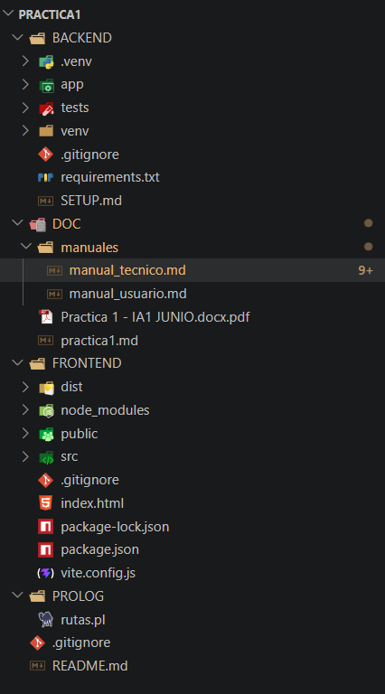

# Manual Tecnico - Rutas Entre Ciudades

## Tabla de contenidos
1. Introduccion arquitectonica
2. Estructura del proyecto
3. Tecnologias utilizadas
4. Backend
5. Frontend
6. Base de conocimiento Prolog
7. Flujo de datos
8. API REST
9. Persistencia actual
10. Riesgos y mejoras futuras

---

## Introduccion arquitectonica

El proyecto implementa una arquitectura de tres capas:

1. **Frontend React/Vite**
   Muestra la interfaz, maneja estado local y consume la API.
2. **Backend FastAPI**
   Expone endpoints REST, valida datos y centraliza la integracion con Prolog.
3. **Motor SWI-Prolog**
   Resuelve rutas y conserva la base de conocimiento declarativa.

---

## Estructura del proyecto




---

## Tecnologias utilizadas

### Backend
- Python
- FastAPI
- Uvicorn
- Pydantic
- PySwip

### Frontend
- React
- Vite
- JavaScript
- CSS

### Logica
- SWI-Prolog

---

## Backend

### `main.py`
- Inicializa la aplicacion FastAPI
- Configura CORS
- Registra el router principal

### `routes.py`
Expone los endpoints:
- `GET /cities`
- `POST /best-route`
- `POST /routes`
- `POST /cities`
- `POST /connections`

### `prolog_service.py`
Responsabilidades principales:
- Cargar `PROLOG/rutas.pl`
- Normalizar nombres de ciudades
- Ejecutar consultas Prolog
- Traducir resultados a modelos Python
- Persistir nuevas ciudades y conexiones en el archivo Prolog

Metodos importantes:
- `get_cities()`
- `get_best_route(origin, destination)`
- `get_all_routes(origin, destination)`
- `add_city(city)`
- `add_connection(origin, destination, distance)`
- `_append_fact_to_file(fact)`

### Persistencai
La persistencia se implemento en el servicio de backend, no en Prolog directamente. Eso simplifica el flujo porque el backend decide cuando anexar hechos al archivo.

---

## Frontend

### `App.jsx`
Es el componente principal y maneja:
- lista de ciudades
- formulario de busqueda
- modo de busqueda
- alta de ciudades
- alta de conexiones
- mensajes de estado y error
- resultados de mejor ruta o todas las rutas

### Cambio reciente en la interfaz
La vista de busqueda ya no usa dos formularios separados.

Ahora existe:
- una sola tarjeta de consulta
- un estado `searchMode`
- un selector visual para cambiar entre:
  - `best`
  - `all`

Segun el modo activo:
- se llama a `fetchBestRoute(...)`
- o se llama a `fetchAllRoutes(...)`

### `api.js`
Cliente HTTP simple basado en `fetch`.

Funciones expuestas:
- `fetchCities()`
- `fetchBestRoute(payload)`
- `fetchAllRoutes(payload)`
- `createCity(payload)`
- `createConnection(payload)`

### `styles.css`
Contiene:
- layout principal
- tarjetas
- tabs
- estilos del selector de modo de busqueda
- panel de resultados
- reglas responsivas

---

## Base de conocimiento Prolog

### Archivo `PROLOG/rutas.pl`
Define:
- hechos `ciudad/1`
- hechos `conexion/3`
- reglas auxiliares para conexiones bidireccionales
- reglas de busqueda de rutas
- reglas para calcular distancia total
- predicados para agregar datos dinamicamente

Ejemplo simplificado:

```prolog
ciudad(guatemala).
conexion(guatemala, antigua, 40).

conectadas(A, B, D) :- conexion(A, B, D).
conectadas(A, B, D) :- conexion(B, A, D).

ruta_mas_corta(Origen, Destino, Ruta, Distancia) :- ...
agregar_ciudad(Ciudad) :- ...
agregar_conexion(Origen, Destino, Distancia) :- ...
```

### Regla funcional importante
Las conexiones se consideran bidireccionales mediante `conectadas/3`, por lo que no hace falta almacenar dos veces el mismo tramo en sentidos opuestos.

---

## Flujo de datos

### Consulta de ruta mas corta
1. El usuario selecciona origen y destino en el frontend.
2. El frontend envia `POST /best-route`.
3. FastAPI recibe la solicitud.
4. `PrologService.get_best_route(...)` ejecuta `ruta_mas_corta(...)`.
5. Prolog devuelve la mejor ruta.
6. El backend transforma el resultado y lo regresa al frontend.

### Consulta de todas las rutas
1. El usuario cambia el modo de busqueda a `Todas las rutas`.
2. El frontend envia `POST /routes`.
3. `PrologService.get_all_routes(...)` consulta `ruta_con_distancia(...)`.
4. Los resultados se ordenan por distancia.
5. El frontend los presenta como lista.

### Alta de ciudad
1. El frontend envia `POST /cities`.
2. El backend normaliza el nombre.
3. Prolog agrega la ciudad en memoria.
4. El backend anexa `ciudad(nombre).` a `PROLOG/rutas.pl`.

### Alta de conexion
1. El frontend envia `POST /connections`.
2. El backend valida ciudades y distancia.
3. Prolog agrega la conexion en memoria.
4. El backend anexa `conexion(origen, destino, distancia).` a `PROLOG/rutas.pl`.

---

## API REST

### `GET /cities`
Devuelve un arreglo de ciudades.

Ejemplo:

```json
["guatemala", "antigua", "escuintla"]
```

### `POST /best-route`
Entrada:

```json
{
  "origin": "guatemala",
  "destination": "puerto_barrios"
}
```

Salida:

```json
{
  "route": ["guatemala", "chiquimula", "puerto_barrios"],
  "distance": 366
}
```

### `POST /routes`
Entrada:

```json
{
  "origin": "guatemala",
  "destination": "puerto_barrios"
}
```

Salida:

```json
[
  {
    "route": ["guatemala", "chiquimula", "puerto_barrios"],
    "distance": 366
  }
]
```

### `POST /cities`
Entrada:

```json
{
  "name": "totonicapan"
}
```

### `POST /connections`
Entrada:

```json
{
  "origin": "totonicapan",
  "destination": "quetzaltenango",
  "distance": 45
}
```

---

## Persistencia actual

- el backend sigue agregando los hechos en memoria mediante Prolog
- despues escribe el hecho nuevo en `PROLOG/rutas.pl`

Implementacion actual en `prolog_service.py`:
- `_append_fact_to_file(...)` abre el archivo en modo append
- `add_city(...)` escribe `ciudad(nombre).`
- `add_connection(...)` escribe `conexion(origen, destino, distancia).`

---