# Manual de Usuario - Rutas Entre Ciudades

## Tabla de contenidos
1. Introduccion
2. Requisitos del sistema
3. Instalacion y ejecucion
4. Interfaz de usuario
5. Funcionalidades
6. Ejemplos de uso
7. Solucion de problemas
8. Preguntas frecuentes

---

## Introduccion

**Rutas Entre Ciudades** es una aplicacion web para consultar rutas entre ciudades y administrar la base de conocimiento usada por Prolog.

### Caracteristicas principales
- Busqueda de ruta mas corta entre dos ciudades
- Visualizacion de todas las rutas posibles
- Cambio de modo de busqueda desde un solo formulario
- Alta de nuevas ciudades
- Alta de nuevas conexiones
- Persistencia de ciudades y conexiones nuevas en `PROLOG/rutas.pl`
- Panel de resultados y estadisticas simples

---

## Requisitos del sistema

### Software necesario
- Node.js 16 o superior
- Python 3.8 o superior
- SWI-Prolog instalado y accesible desde PATH

### Navegador recomendado
- Chrome, Edge o Firefox actuales

---

## Instalacion y ejecucion

### Backend

```powershell
cd PRACTICA1\BACKEND
.\.venv\Scripts\Activate.ps1
```


### Frontend

```powershell
cd PRACTICA1\FRONTEND
npm install
npm run dev
```

### Acceso

- Frontend: `http://localhost:5173`
- Backend docs: `http://127.0.0.1:8000/docs`

---

## Interfaz de usuario

### Header principal
- Muestra el titulo de la aplicacion
- Presenta el total de ciudades cargadas
- Muestra la cantidad de rutas en el resultado actual
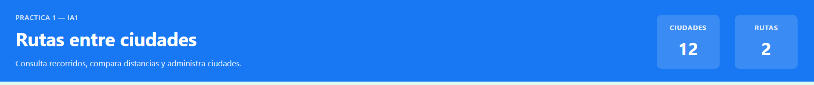


### Pestanas principales
- `Buscar`: consulta rutas
- `Gestionar`: agrega ciudades y conexiones


### Vista Buscar
- Usa una sola tarjeta de consulta
- Tiene un selector para cambiar entre:
  - `Ruta mas corta`
  - `Todas las rutas`

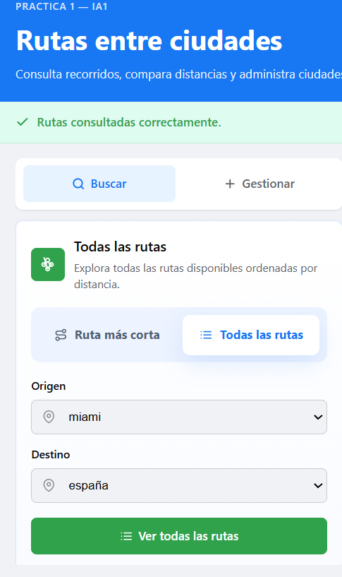


### Vista Gestionar
- Formulario para agregar ciudad
- Formulario para agregar conexion

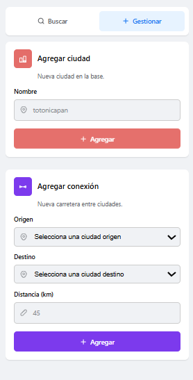

### Panel de resultados
- Muestra la mejor ruta cuando el modo activo es `Ruta mas corta`
- Muestra una lista de rutas cuando el modo activo es `Todas las rutas`
- Si no hay resultados, muestra un mensaje vacio
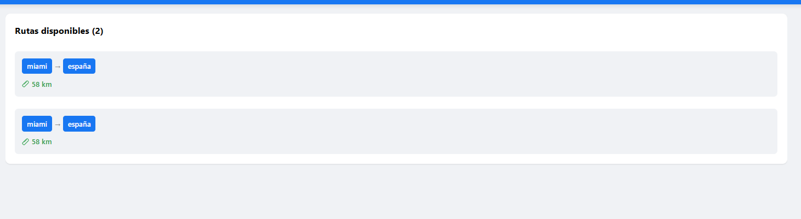

---

## Funcionalidades

### Buscar rutas

#### Ruta mas corta
1. Abre la pestana `Buscar`.
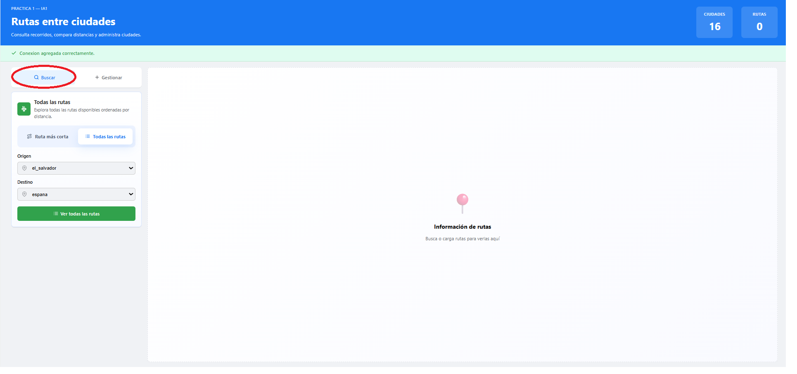
2. Selecciona el modo `Ruta mas corta`.
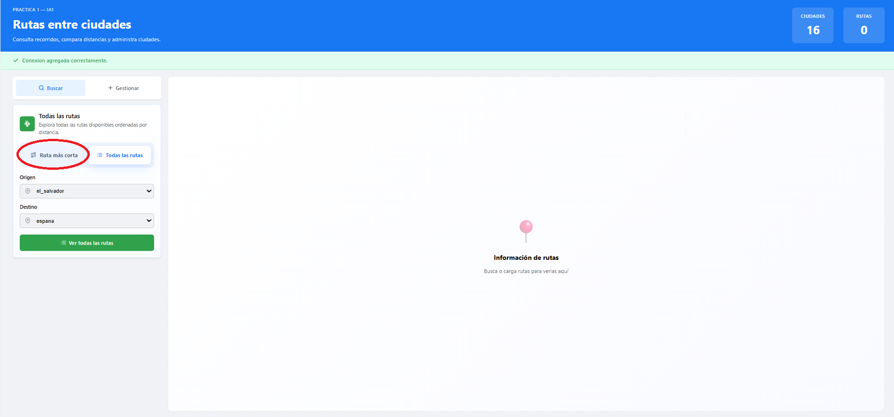
3. Elige ciudad de `Origen`.
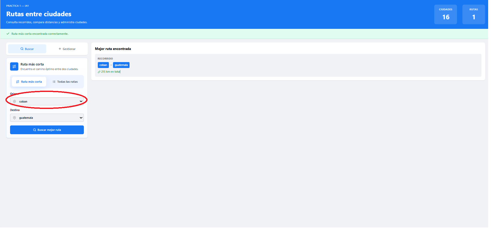
4. Elige ciudad de `Destino`.
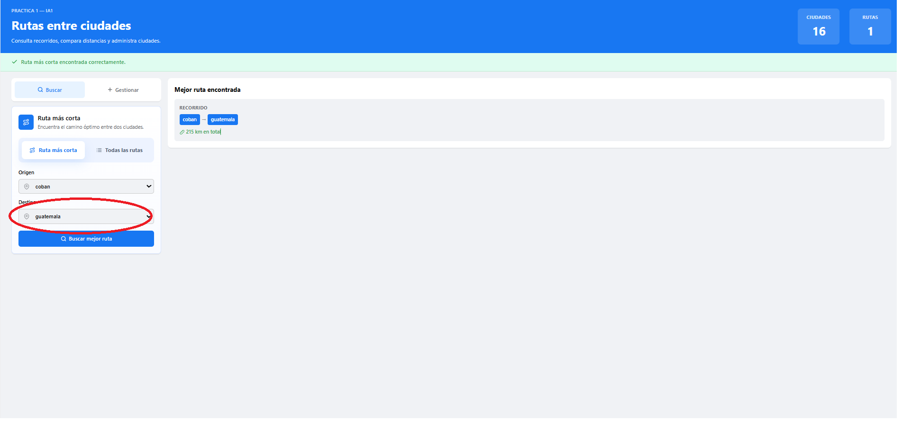
5. Pulsa `Buscar mejor ruta`.
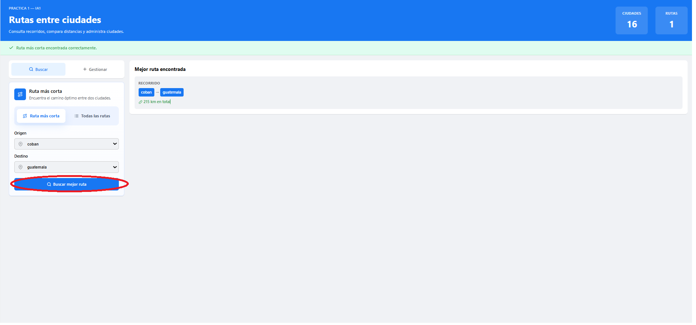

Resultado esperado:
- Se muestra una sola ruta en el panel derecho.
- Se muestra la distancia total en kilometros.
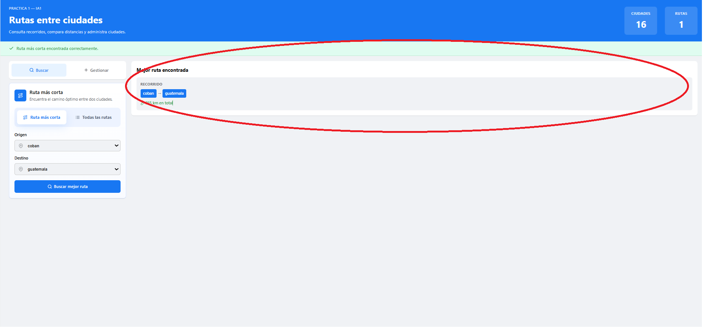


#### Todas las rutas
1. Abre la pestana `Buscar`.
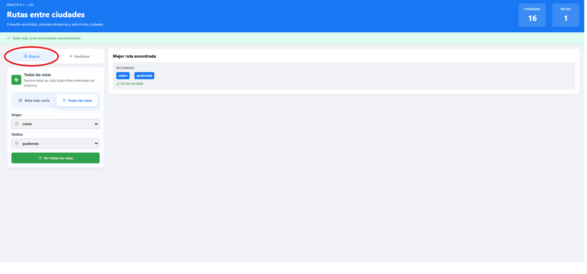
2. Selecciona el modo `Todas las rutas`.
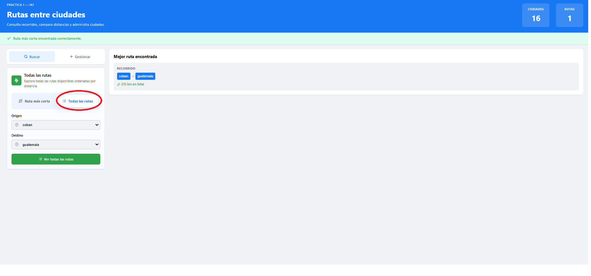
3. Elige ciudad de `Origen`.
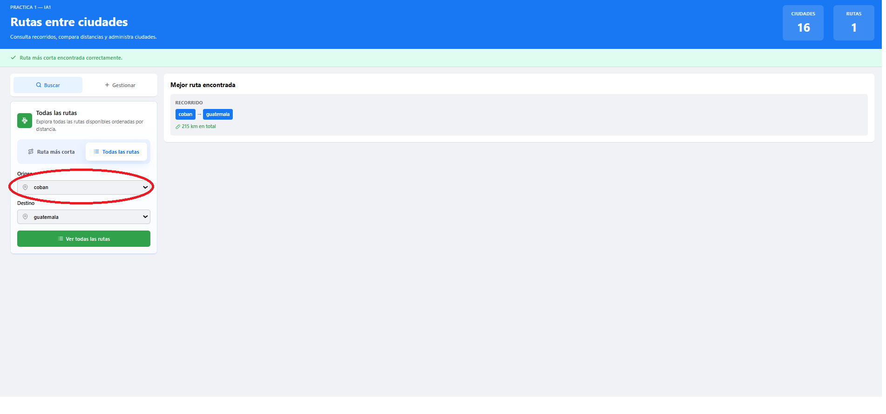
4. Elige ciudad de `Destino`.
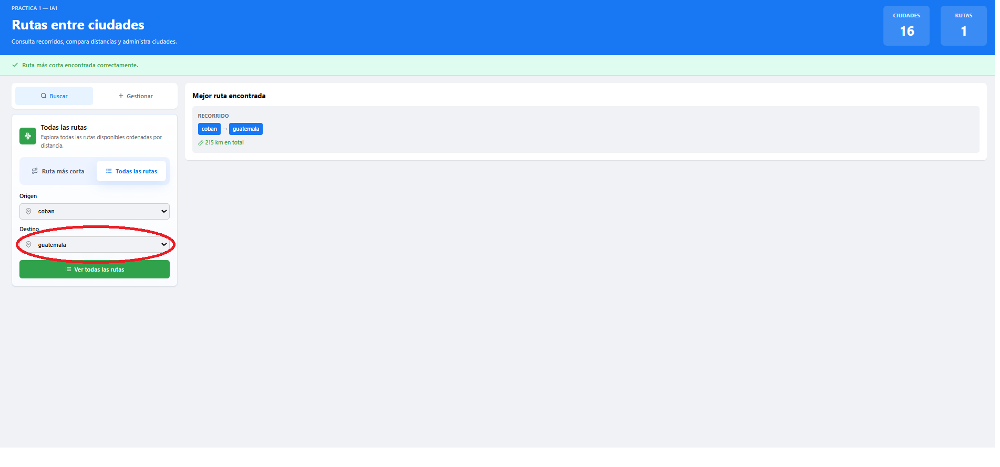
5. Pulsa `Ver todas las rutas`.
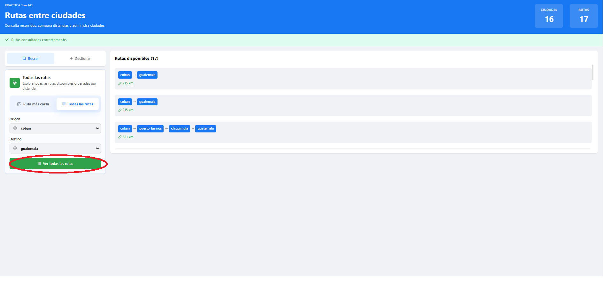

Resultado esperado:
- Se muestra un listado ordenado por distancia.
- Cada resultado incluye recorrido y distancia total.
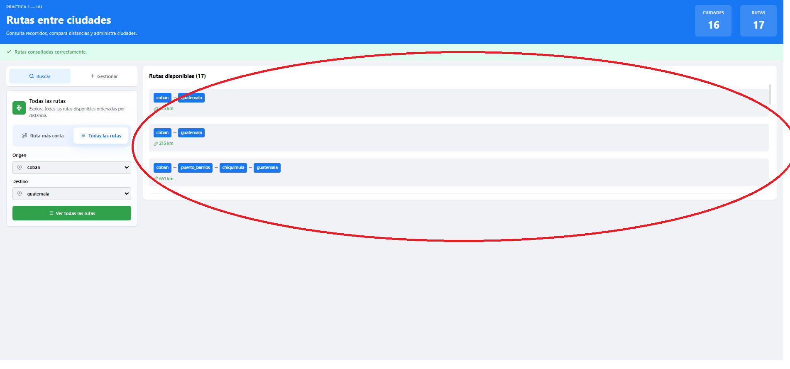


### Agregar ciudad
1. Abre la pestana `Gestionar`.
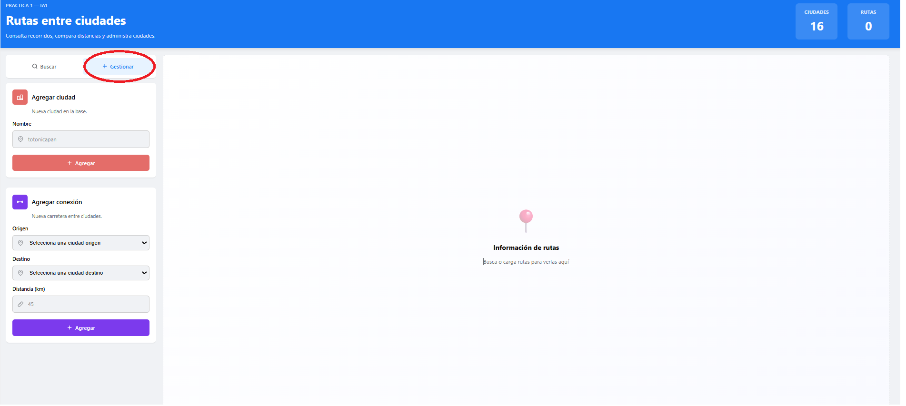
2. En `Agregar ciudad`, escribe el nombre.
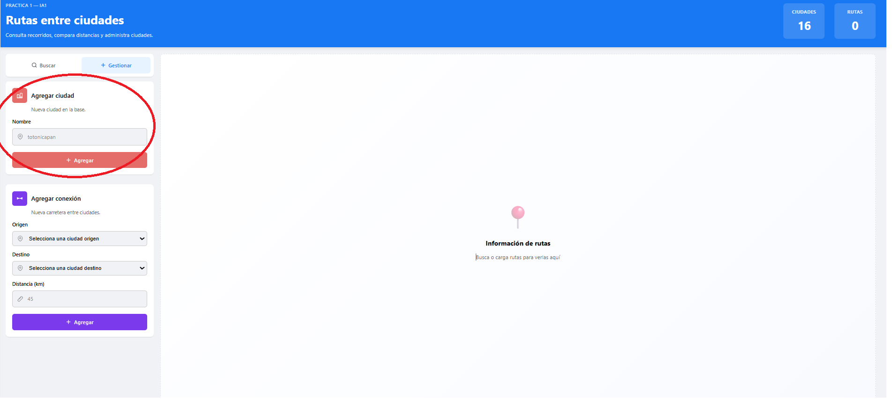
3. Pulsa `Agregar`.
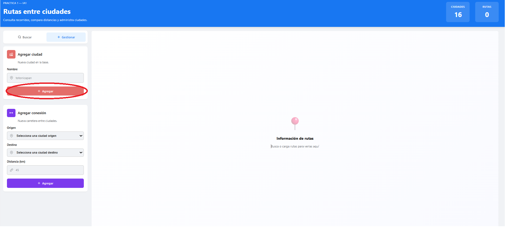


Resultado esperado:
- Aparece mensaje de exito.
- La ciudad se agrega al listado de ciudades.
- La ciudad se guarda en `PROLOG/rutas.pl`.

### Agregar conexion
1. Abre la pestana `Gestionar`.

2. En `Agregar conexion`, selecciona:
   - `Origen`
   - `Destino`
   - `Distancia`

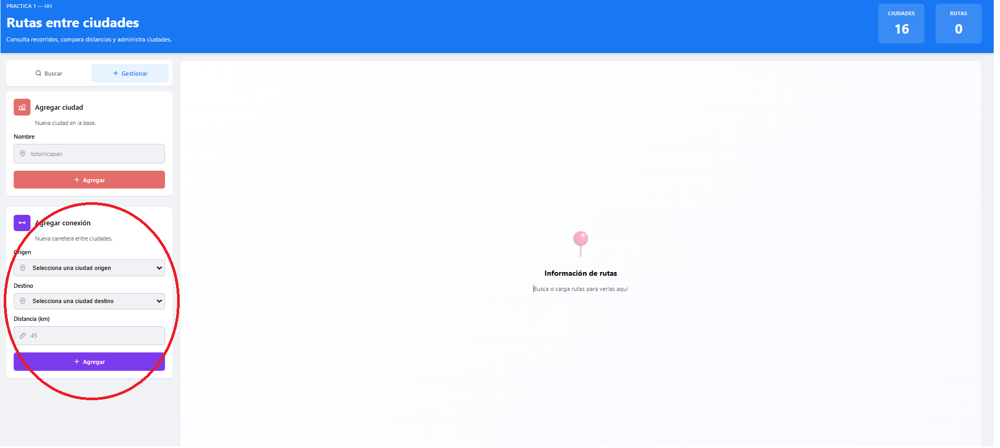
3. Pulsa `Agregar`.
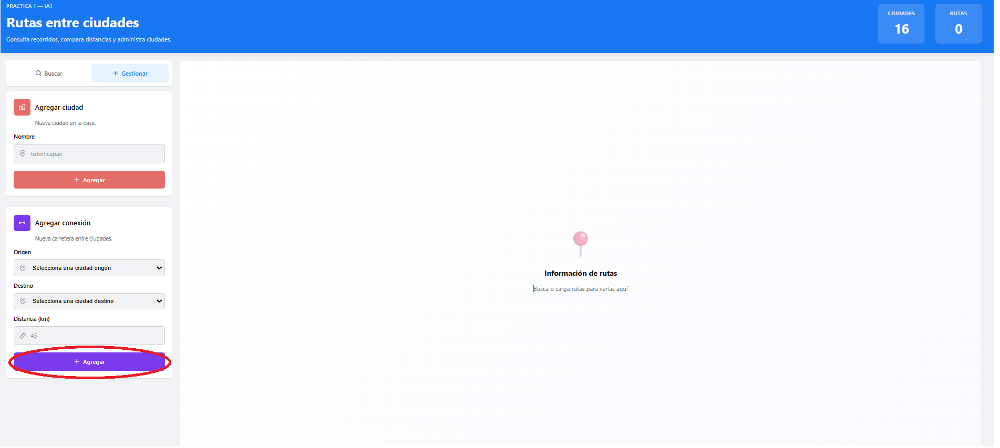

Resultado esperado:
- Aparece mensaje de exito.
- La conexion queda disponible para nuevas consultas.
- La conexion se guarda en `PROLOG/rutas.pl`.

### Persistencia

Las altas nuevas ya no se pierden al reiniciar el backend:
- `POST /cities` agrega la ciudad en memoria y tambien la escribe en `PROLOG/rutas.pl`
- `POST /connections` agrega la conexion en memoria y tambien la escribe en `PROLOG/rutas.pl`

Esto permite que, al iniciar de nuevo el backend, Prolog vuelva a cargar esos datos desde el archivo.

---

## Ejemplos de uso

### Ejemplo 1: Buscar la mejor ruta
Objetivo: encontrar la mejor ruta de `guatemala` a `puerto_barrios`.

Pasos:
1. Abre `Buscar`.
2. Elige `Ruta mas corta`.
3. Selecciona `guatemala` como origen.
4. Selecciona `puerto_barrios` como destino.
5. Pulsa `Buscar mejor ruta`.

### Ejemplo 2: Ver todas las rutas
Objetivo: ver todas las rutas de `escuintla` a `puerto_barrios`.

Pasos:
1. Abre `Buscar`.
2. Elige `Todas las rutas`.
3. Selecciona origen y destino.
4. Pulsa `Ver todas las rutas`.

### Ejemplo 3: Agregar una ciudad
Objetivo: agregar `totonicapan`.

Pasos:
1. Abre `Gestionar`.
2. En `Agregar ciudad`, escribe `totonicapan`.
3. Pulsa `Agregar`.

### Ejemplo 4: Agregar una conexion
Objetivo: conectar `totonicapan` con `quetzaltenango` con distancia `45`.

Pasos:
1. Abre `Gestionar`.
2. Selecciona origen y destino.
3. Escribe `45`.
4. Pulsa `Agregar`.

---

## Solucion de problemas

### El backend no responde
Verifica que este ejecutandose:

```powershell
cd PRACTICA1\BACKEND
.\.venv\Scripts\Activate.ps1
```

### El frontend no carga
Verifica que Vite este levantado:

```powershell
cd PRACTICA1\FRONTEND
npm run dev
```

### No aparece una ruta
- Revisa que ambas ciudades existan
- Revisa que haya conexiones entre ellas
- Si acabas de crear una conexion, vuelve a intentar la consulta

### Error al agregar ciudad o conexion
- El nombre no debe ir vacio
- La distancia debe ser mayor que cero
- La ciudad no debe estar duplicada
- La conexion debe usar ciudades existentes

---