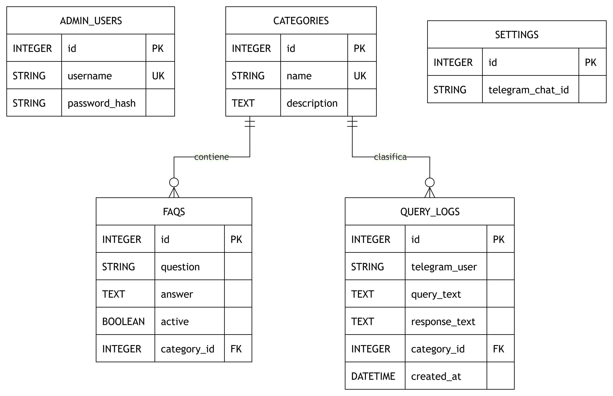

# Manual Tecnico - SmartBot

## Descripcion general

SmartBot es un sistema de respuestas automatizadas para Telegram. El sistema permite administrar preguntas frecuentes, respuestas y categorias desde un panel web, almacenar la informacion en una base de datos SQLite y responder consultas de usuarios mediante un bot conectado a una API REST.

La solucion esta compuesta por tres servicios principales:

- Backend en Python con FastAPI.
- Frontend administrativo en React + Vite.
- Bot de Telegram desarrollado con `python-telegram-bot`.

## Arquitectura

El sistema utiliza una arquitectura cliente-servidor basada en API REST. El panel administrativo y el bot no acceden directamente a la base de datos; ambos se comunican con el backend mediante endpoints REST.


## Patron de arquitectura

El patron utilizado es una arquitectura por capas con separacion entre presentacion, logica de negocio y persistencia:

- Capa de presentacion: panel administrativo React y bot de Telegram.
- Capa de servicios/API: backend FastAPI que expone endpoints REST.
- Capa de persistencia: modelos SQLAlchemy y base de datos SQLite.

Esta separacion permite que el panel y el bot consuman la misma API sin duplicar la logica de acceso a datos.

## Tecnologias utilizadas

- Python 3.11
- FastAPI
- SQLAlchemy
- SQLite
- React
- Vite
- python-telegram-bot
- Docker
- Docker Compose
- JWT para autenticacion

## Estructura del proyecto

```txt
PRACTICA2/
+-- backend/
|   +-- app/
|   |   +-- auth.py
|   |   +-- database.py
|   |   +-- dependencies.py
|   |   +-- main.py
|   |   +-- models.py
|   |   +-- routers/
|   |   |   +-- admin_users.py
|   |   |   +-- auth.py
|   |   |   +-- bot.py
|   |   |   +-- categories.py
|   |   |   +-- dashboard.py
|   |   |   +-- faqs.py
|   |   |   +-- settings.py
|   |   +-- schemas.py
|   |   +-- seed.py
|   +-- bot/
|   |   +-- main.py
|   +-- Dockerfile
|   +-- requirements.txt
+-- database/
|   +-- smartbot.db
+-- docs/
|   +-- Manual_Tecnico.md
|   +-- Manual_Usuario.md
+-- frontend/
|   +-- src/
|   |   +-- api.js
|   |   +-- main.jsx
|   |   +-- styles.css
|   +-- package.json
+-- docker-compose.yml
+-- README.md
```

## Base de datos

La base de datos utilizada es SQLite. En ejecucion local se usa el archivo:

```txt
database/smartbot.db
```

En Docker Compose, SQLite se guarda como archivo dentro del servicio backend:

```txt
/data/smartbot.db
```

La ruta `/data` esta conectada a un volumen persistente llamado `smartbot_data`, por lo que la informacion se conserva aunque los contenedores se reinicien.

## Modelo de datos

Entidades principales:

- `admin_users`: almacena usuarios administradores.
- `categories`: almacena categorias de preguntas.
- `faqs`: almacena preguntas frecuentes y respuestas.
- `settings`: almacena configuracion del sistema, como el ID de Telegram.
- `query_logs`: almacena consultas realizadas por usuarios de Telegram.

## Diagrama ER




## Descripcion de tablas

### admin_users

Tabla encargada de almacenar los usuarios administradores del panel.

| Campo | Tipo | Descripcion |
| --- | --- | --- |
| id | INTEGER | Identificador unico |
| username | STRING | Nombre de usuario unico |
| password_hash | STRING | Contrasena cifrada |

### categories

Tabla encargada de clasificar las preguntas frecuentes.

| Campo | Tipo | Descripcion |
| --- | --- | --- |
| id | INTEGER | Identificador unico |
| name | STRING | Nombre unico de la categoria |
| description | TEXT | Descripcion de la categoria |

### faqs

Tabla encargada de almacenar preguntas y respuestas.

| Campo | Tipo | Descripcion |
| --- | --- | --- |
| id | INTEGER | Identificador unico |
| question | STRING | Pregunta registrada |
| answer | TEXT | Respuesta asociada |
| active | BOOLEAN | Indica si la pregunta esta activa |
| category_id | INTEGER | Llave foranea hacia `categories` |

### settings

Tabla encargada de almacenar la configuracion general del sistema.

| Campo | Tipo | Descripcion |
| --- | --- | --- |
| id | INTEGER | Identificador unico |
| telegram_chat_id | STRING | ID del chat o grupo de Telegram |

### query_logs

Tabla encargada de registrar las consultas realizadas desde Telegram.

| Campo | Tipo | Descripcion |
| --- | --- | --- |
| id | INTEGER | Identificador unico |
| telegram_user | STRING | Usuario de Telegram |
| query_text | TEXT | Consulta enviada |
| response_text | TEXT | Respuesta enviada por el bot |
| category_id | INTEGER | Categoria relacionada, si existe |
| created_at | DATETIME | Fecha y hora de la consulta |

## API REST

El backend expone endpoints REST para autenticacion, administracion de informacion, configuracion y consultas del bot.

Los endpoints estan organizados por modulos mediante `APIRouter` de FastAPI:

- `routers/auth.py`: autenticacion.
- `routers/admin_users.py`: usuarios administradores.
- `routers/dashboard.py`: estadisticas del panel.
- `routers/categories.py`: categorias.
- `routers/faqs.py`: preguntas frecuentes y respuestas.
- `routers/settings.py`: configuracion del bot.
- `routers/bot.py`: consultas recibidas desde Telegram.

### Endpoints generales

| Metodo | Endpoint | Descripcion |
| --- | --- | --- |
| GET | `/health` | Verifica el estado del servicio |

### Autenticacion

| Metodo | Endpoint | Descripcion |
| --- | --- | --- |
| POST | `/api/auth/login` | Autentica al administrador y devuelve un token JWT |

### Administradores

| Metodo | Endpoint | Descripcion |
| --- | --- | --- |
| GET | `/api/admin-users` | Lista usuarios administradores |
| POST | `/api/admin-users` | Crea un nuevo usuario administrador |

### Dashboard

| Metodo | Endpoint | Descripcion |
| --- | --- | --- |
| GET | `/api/dashboard` | Devuelve estadisticas generales, consultas frecuentes y categorias mas consultadas |

### Categorias

| Metodo | Endpoint | Descripcion |
| --- | --- | --- |
| GET | `/api/categories` | Lista categorias |
| POST | `/api/categories` | Crea una categoria |
| PUT | `/api/categories/{category_id}` | Actualiza una categoria |
| DELETE | `/api/categories/{category_id}` | Elimina una categoria |

### Preguntas frecuentes

| Metodo | Endpoint | Descripcion |
| --- | --- | --- |
| GET | `/api/faqs` | Lista preguntas frecuentes |
| POST | `/api/faqs` | Crea una pregunta frecuente |
| PUT | `/api/faqs/{faq_id}` | Actualiza una pregunta frecuente |
| DELETE | `/api/faqs/{faq_id}` | Elimina una pregunta frecuente |

### Configuracion

| Metodo | Endpoint | Descripcion |
| --- | --- | --- |
| GET | `/api/settings` | Obtiene la configuracion del sistema |
| PUT | `/api/settings` | Actualiza el ID de Telegram |

El campo `telegram_chat_id` representa el chat o grupo de Telegram autorizado para utilizar el bot. Este valor se administra desde el panel web y se almacena en la tabla `settings`. El bot valida este ID antes de responder; si el mensaje proviene de otro chat, la consulta se ignora y no se envia respuesta.

### Bot

| Metodo | Endpoint | Descripcion |
| --- | --- | --- |
| POST | `/api/bot/query` | Recibe una consulta del bot y devuelve una respuesta almacenada |
| GET | `/api/bot/settings` | Devuelve el ID de chat o grupo configurado para el envio de mensajes del bot |

## Autenticacion

El panel administrativo esta protegido mediante autenticacion JWT. El usuario inicia sesion con credenciales preconfiguradas:

```txt
Usuario: IA1-User
Contrasena: IA1-password@_new
```

Cuando el inicio de sesion es correcto, la API devuelve un token. El frontend guarda el token en `localStorage` y lo envia en cada solicitud protegida mediante el encabezado:

```txt
Authorization: Bearer <token>
```

## Flujo del sistema

### Flujo del administrador

1. El administrador ingresa al panel web.
2. El panel envia las credenciales al endpoint `/api/auth/login`.
3. El backend valida el usuario y devuelve un token JWT.
4. El administrador gestiona categorias, preguntas, respuestas y configuracion.
5. El backend persiste los cambios en SQLite.

### Flujo del bot de Telegram

1. El usuario envia un mensaje al bot de Telegram.
2. El bot recibe el mensaje con `python-telegram-bot`.
3. El bot consulta `/api/bot/settings` para obtener el ID de chat o grupo configurado desde el panel administrativo.
4. El bot compara el ID configurado con el ID del chat que envio el mensaje.
5. Si el ID no coincide, el bot ignora el mensaje y no envia respuesta.
6. Si el ID coincide, el bot envia la consulta al endpoint `/api/bot/query`.
7. El backend busca una pregunta activa relacionada en la tabla `faqs`.
8. Si existe respuesta, la API la devuelve al bot.
9. Si no existe respuesta, la API devuelve un mensaje indicando que no hay respuesta registrada.
10. La consulta queda almacenada en `query_logs` junto con el ID del chat.
11. El bot envia la respuesta al chat autorizado.

## Manejo de errores

El backend utiliza `HTTPException` de FastAPI para responder errores controlados:

- `401 Unauthorized`: token faltante, invalido o credenciales incorrectas.
- `400 Bad Request`: datos invalidos, categoria repetida o categoria no valida.
- `404 Not Found`: recurso no encontrado.

Tambien se manejan errores de integridad de base de datos mediante `IntegrityError` de SQLAlchemy.

## Docker Compose

El proyecto se ejecuta mediante Docker Compose con tres servicios:

- `backend`: ejecuta la API REST FastAPI.
- `frontend`: ejecuta el panel administrativo React + Vite.
- `bot`: ejecuta el bot de Telegram.

Fragmento principal de configuracion:

```yaml
services:
  backend:
    build:
      context: ./backend
    ports:
      - "8000:8000"
    volumes:
      - smartbot_data:/data
    environment:
      - DATABASE_URL=sqlite:////data/smartbot.db

  frontend:
    image: node:22-alpine
    ports:
      - "5173:5173"
    environment:
      - VITE_API_URL=http://localhost:8000

  bot:
    build:
      context: ./backend
    command: python -m bot.main
    environment:
      - API_URL=http://backend:8000

volumes:
  smartbot_data:
```

## Variables de entorno

El proyecto utiliza un archivo `.env` en la raiz para configurar Telegram.

```env
TELEGRAM_BOT_TOKEN=token_de_botfather
TELEGRAM_CHAT_ID=id_del_chat_o_grupo
```

Variables principales:

| Variable | Descripcion |
| --- | --- |
| TELEGRAM_BOT_TOKEN | Token generado por BotFather |
| TELEGRAM_CHAT_ID | ID del chat o grupo de Telegram |
| DATABASE_URL | Cadena de conexion hacia SQLite |
| API_URL | URL usada por el bot para consultar la API |
| VITE_API_URL | URL usada por el frontend para consumir la API |

## Ejecucion del proyecto

### Ejecucion con Docker Compose

```bash
docker compose up --build
```

Servicios disponibles:

```txt
Panel administrativo: http://localhost:5173
API REST: http://localhost:8000/docs
```

### Ejecucion local del backend

```bash
cd backend
python -m venv .venv
.venv\Scripts\activate
pip install -r requirements.txt
uvicorn app.main:app --reload
```

### Ejecucion local del frontend

```bash
cd frontend
npm install
npm run dev
```

## Requerimientos funcionales implementados

- Inicio de sesion para administradores.
- Usuario administrador preconfigurado.
- CRUD de preguntas frecuentes.
- CRUD de categorias.
- Registro de administradores.
- Configuracion del ID de Telegram.
- Recepcion de mensajes desde Telegram.
- Consulta de respuestas mediante API REST.
- Respuesta automatica desde informacion almacenada en la base de datos.
- Manejo de consultas sin respuesta registrada.
- Registro de consultas en base de datos.
- Visualizacion de estadisticas en el panel administrativo.

## Requerimientos no funcionales

- Seguridad: el panel esta protegido con autenticacion JWT.
- Persistencia: la informacion se almacena en SQLite.
- Portabilidad: el proyecto se ejecuta con Docker Compose.
- Mantenibilidad: el codigo separa autenticacion, modelos, esquemas, base de datos, bot y frontend.
- Usabilidad: el panel permite gestionar informacion sin modificar el codigo fuente.

## Posibles mejoras futuras

- Separar los endpoints en routers por modulo.
- Agregar paginacion y filtros avanzados en preguntas frecuentes.
- Mejorar el algoritmo de busqueda de respuestas con coincidencia aproximada.
- Agregar pruebas automatizadas para endpoints principales.
- Permitir roles de usuario administrador.
