# Manual de Usuario - SmartBot

## Descripcion

SmartBot es un sistema que permite administrar preguntas frecuentes, respuestas y categorias desde un panel web. La informacion registrada se utiliza para responder consultas realizadas desde Telegram mediante un bot.

## Requisitos previos

Antes de usar el sistema se necesita:

- Docker Desktop o Docker Engine instalado.
- Docker Compose instalado.
- Un bot creado en Telegram mediante BotFather.
- Token del bot de Telegram.
- Navegador web actualizado.

## Configuracion inicial

En la raiz del proyecto debe existir un archivo `.env` con el token del bot:

```env
TELEGRAM_BOT_TOKEN=token_generado_por_botfather
TELEGRAM_CHAT_ID=id_inicial_opcional
```

El valor `TELEGRAM_BOT_TOKEN` es obligatorio para conectar el bot con Telegram. El valor `TELEGRAM_CHAT_ID` es opcional, porque el ID del chat tambien puede configurarse desde el panel administrativo.

## Ejecutar el sistema

Desde la raiz del proyecto, ejecutar:

```bash
docker compose up --build
```

Cuando los servicios esten levantados, abrir el panel administrativo en:

```txt
http://localhost:5173
```

La API REST se puede consultar en:

```txt
http://localhost:8000/docs
```

## Inicio de sesion

1. Abrir `http://localhost:5173`.
2. Ingresar las credenciales del administrador:

```txt
Usuario: IA1-User
Contrasena: IA1-password@_new
```

3. Presionar `Ingresar`.


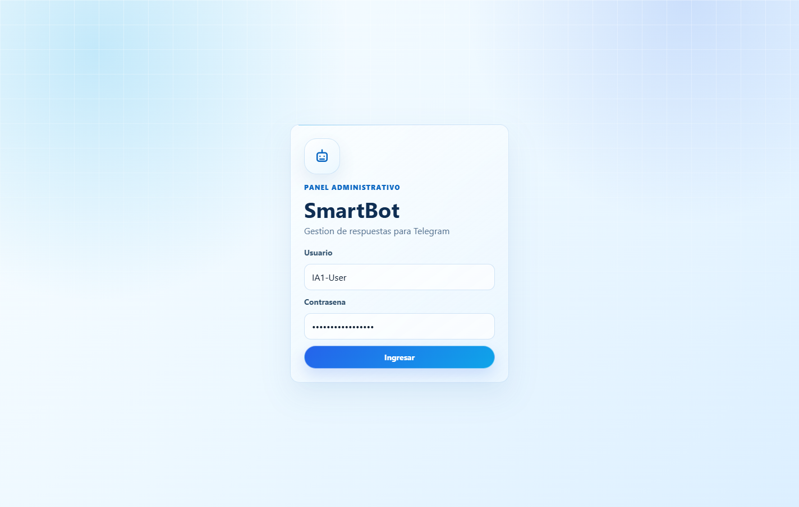

## Pantalla de inicio

La pantalla de inicio muestra un resumen del sistema:

- Cantidad de preguntas registradas.
- Cantidad de categorias.
- Cantidad de consultas realizadas.
- Cantidad de usuarios o chats registrados.
- Consultas frecuentes.
- Categorias mas consultadas.

En la tabla de consultas frecuentes tambien se muestra el ID del chat que realizo la consulta.


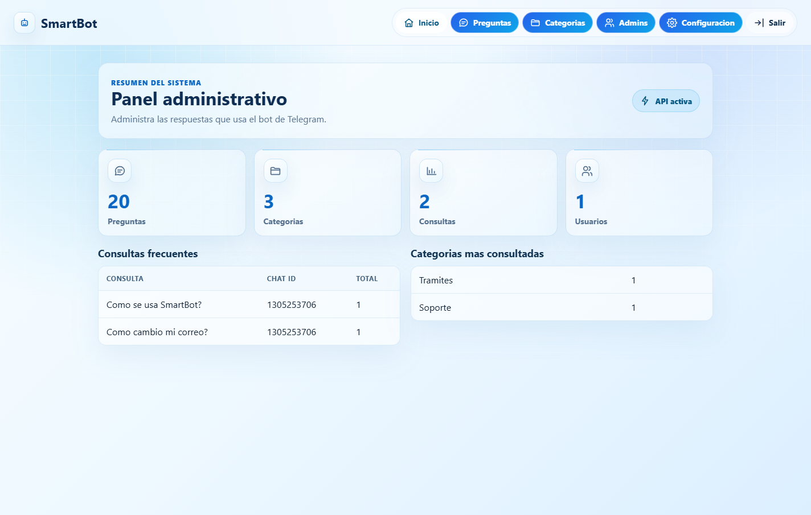

## Gestionar preguntas y respuestas

Para crear una pregunta:

1. Entrar a la opcion `Preguntas`.

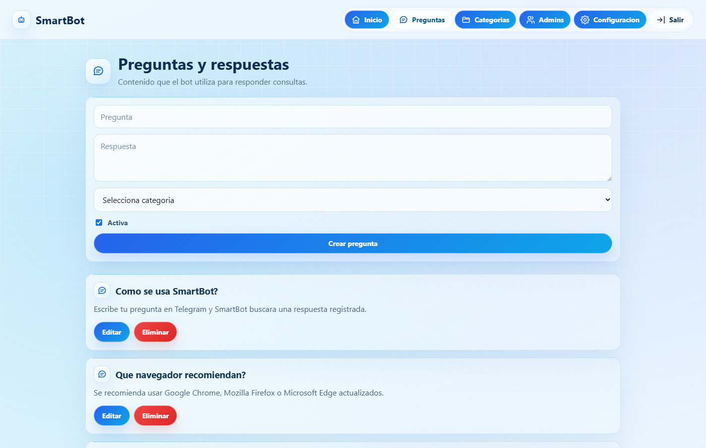

2. Escribir la pregunta.
3. Escribir la respuesta.
4. Seleccionar una categoria.
5. Marcar si la pregunta estara activa.
6. Presionar `Crear pregunta`.

Para editar una pregunta:

1. Buscar la pregunta en la lista.
2. Presionar `Editar`.
3. Modificar los datos en la ventana emergente.

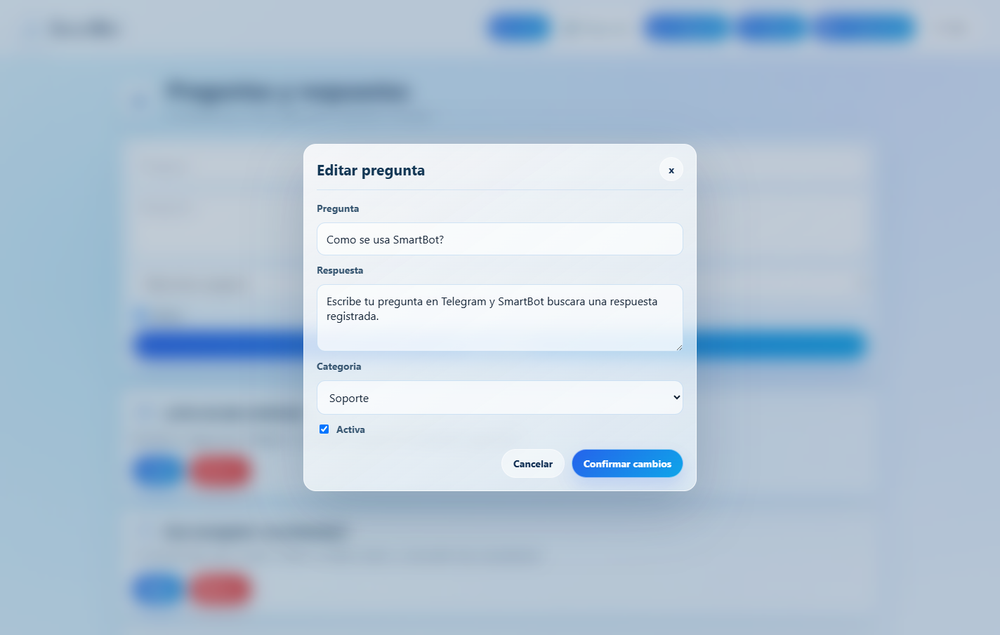

4. Presionar `Confirmar cambios`.
5. El sistema mostrara un mensaje de confirmacion.

Para eliminar una pregunta:

1. Buscar la pregunta en la lista.
2. Presionar `Eliminar`.
3. Confirmar la eliminacion en la ventana emergente.

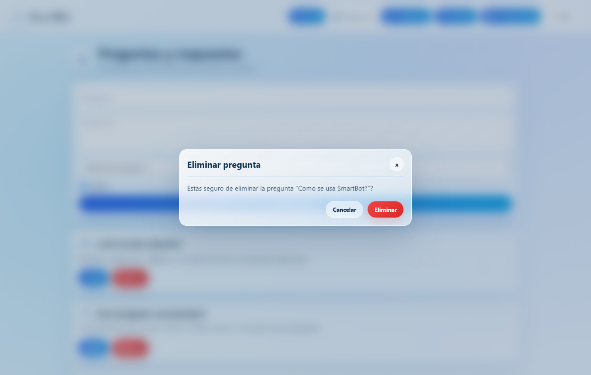

4. El sistema mostrara un mensaje de confirmacion.


## Gestionar categorias

Para crear una categoria:

1. Entrar a la opcion `Categorias`.

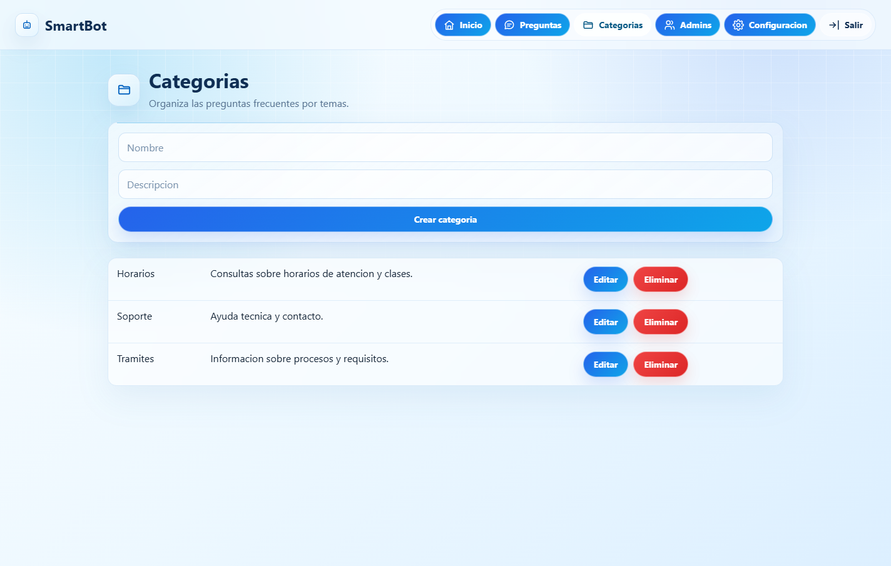

2. Escribir el nombre de la categoria.
3. Escribir una descripcion opcional.
4. Presionar `Crear categoria`.

Para editar una categoria:

1. Buscar la categoria en la tabla.
2. Presionar `Editar`.
3. Modificar los datos en la ventana emergente.

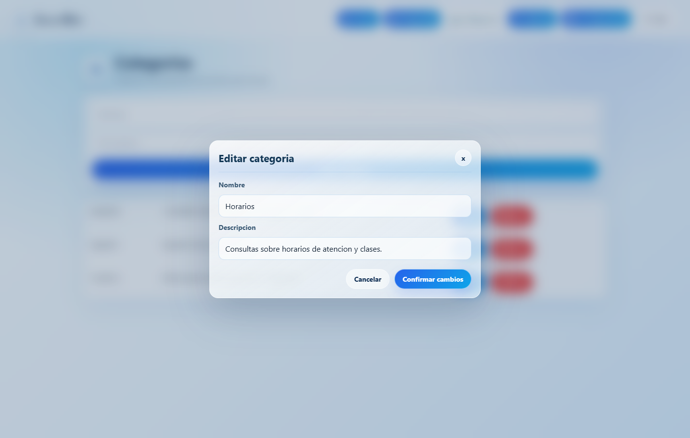

4. Presionar `Confirmar cambios`.
5. El sistema mostrara un mensaje de confirmacion.

Para eliminar una categoria:

1. Buscar la categoria en la tabla.
2. Presionar `Eliminar`.
3. Confirmar la eliminacion en la ventana emergente.

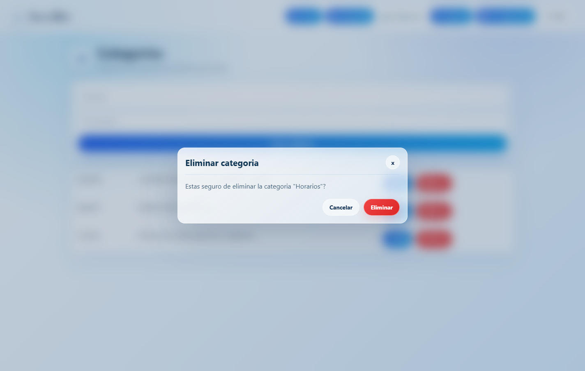

4. El sistema mostrara un mensaje de confirmacion.

Nota: no se puede eliminar una categoria si tiene preguntas asociadas.

## Gestionar administradores

Para crear un nuevo administrador:

1. Entrar a la opcion `Admins`.
2. Escribir el nombre del nuevo usuario.
3. Escribir una contrasena de al menos 8 caracteres.
4. Presionar `Registrar administrador`.
5. El sistema mostrara el nuevo usuario en la tabla.


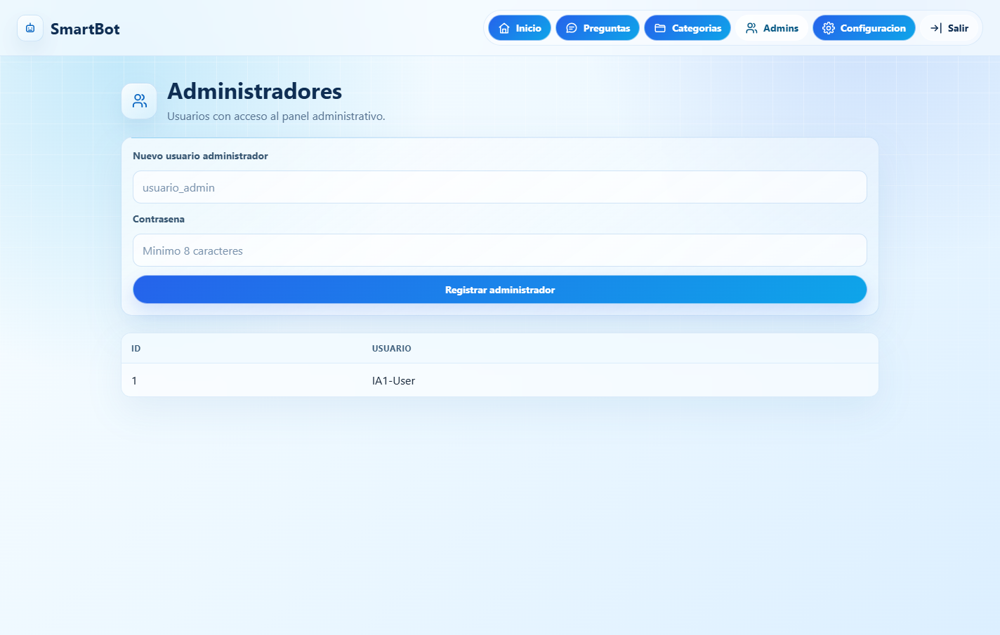

## Configuracion de Telegram

El sistema permite configurar el ID del chat o grupo autorizado para utilizar el bot.

Para obtener el ID correcto:

1. Abrir Telegram.
2. Entrar al chat privado con el bot o al grupo donde se usara el bot.
3. Escribir el comando:

```txt
/id
```


4. Copiar el ID que responde el bot.

Para guardar el ID en el panel:

1. Entrar a la opcion `Configuracion`.
2. Pegar el ID del chat o grupo de Telegram.
3. Presionar `Guardar`.

El bot solo respondera mensajes enviados desde el chat o grupo configurado. Si otro usuario o grupo escribe al bot desde un chat diferente, el mensaje sera ignorado.


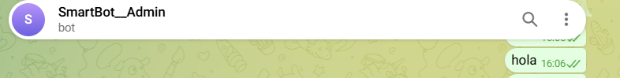


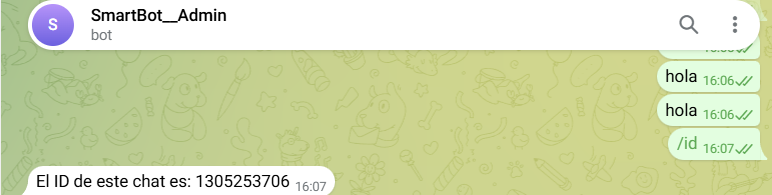

## Uso del bot de Telegram

Para consultar informacion desde Telegram:

1. Verificar que el bot este agregado al chat o grupo configurado.
2. Verificar que el ID del chat o grupo este guardado en el panel administrativo.
3. Escribir una consulta al bot, por ejemplo:

```txt
Cual es el horario de atencion?
```

4. El bot consultara la API REST.
5. La API buscara una respuesta almacenada en la base de datos.
6. El bot enviara la respuesta al chat autorizado.

Si no existe una respuesta registrada, el bot respondera:

```txt
No encontre una respuesta registrada para esa consulta.
```


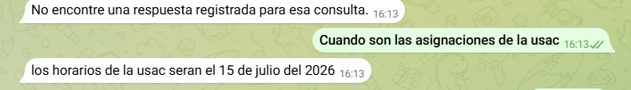


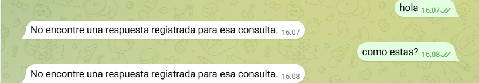

## Cerrar sesion

Para salir del panel:

1. Presionar el boton `Salir` en la barra superior.
2. El sistema regresara a la pantalla de inicio de sesion.

## Recomendaciones de uso

- Registrar primero las categorias antes de crear preguntas.
- Mantener preguntas claras y directas para mejorar la coincidencia de respuestas.
- Configurar correctamente el ID del chat o grupo antes de probar el bot.
- Si el bot no responde en un grupo, verificar que este agregado al grupo y que tenga permisos para leer mensajes.
- En grupos de Telegram, si el bot no recibe mensajes normales, revisar la configuracion de privacidad del bot en BotFather.
