# Manual de Usuario - SmartInvoice

## 1. Introducción

SmartInvoice es una aplicación web para automatizar el procesamiento de facturas. El
sistema permite cargar documentos PDF o imágenes, extraer sus datos mediante OCR,
validar la información, registrar la factura en un formulario contable simulado mediante
RPA, generar reportes administrativos y enviar los resultados por correo electrónico.

Este manual describe el uso del sistema desde el inicio de sesión hasta la comprobación
final en la bitácora.

## 2. Requisitos para utilizar el sistema

- Navegador web moderno, preferiblemente Google Chrome, Microsoft Edge o Firefox.
- Dirección web de SmartInvoice.
- Usuario y contraseña registrados.
- Factura en formato PDF, JPG, JPEG o PNG, con un tamaño máximo de 10 MB.

Para una ejecución local, la interfaz se encuentra en:

`http://localhost:5173`

## 3. Flujo recomendado

El proceso normal de trabajo es el siguiente:

1. Iniciar sesión.
2. Cargar una factura.
3. Ejecutar el OCR.
4. Comparar y validar los datos extraídos.
5. Registrar la factura mediante RPA.
6. Generar el reporte administrativo.
7. Verificar el envío por correo.
8. Consultar la bitácora y las evidencias.

> **Importante:** la barra superior de SmartInvoice indica en qué etapa se encuentra el
> usuario y cuál es el siguiente paso recomendado.

## 4. Inicio de sesión

1. Abra SmartInvoice en el navegador.
2. Escriba el correo electrónico de su usuario.
3. Escriba la contraseña.
4. Seleccione **Ingresar al sistema**.

Si los datos son correctos, el sistema abrirá el panel principal. Si son incorrectos,
SmartInvoice mostrará un mensaje y permitirá intentar nuevamente.

## 5. Panel principal

El panel presenta un resumen de la actividad, el estado de las facturas, las
automatizaciones realizadas y el flujo recomendado.

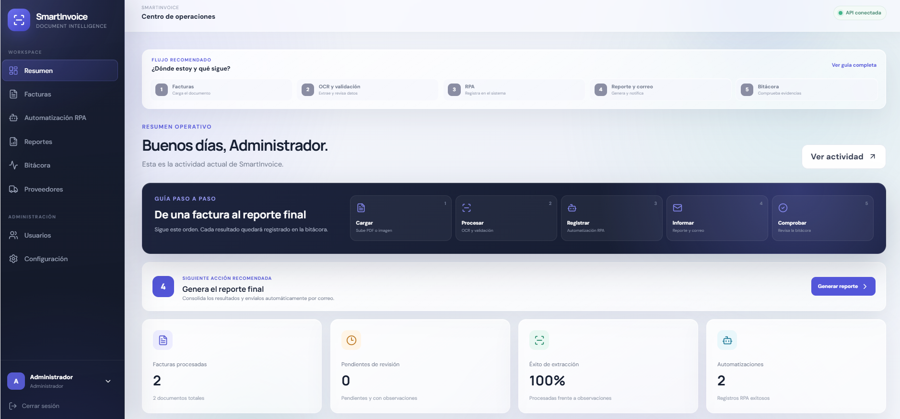

Desde el menú lateral se puede ingresar a:

- **Resumen:** indicadores generales y siguiente acción recomendada.
- **Facturas:** carga, procesamiento, consulta y validación.
- **Automatización RPA:** registro automático en el sistema simulado.
- **Reportes:** generación, descarga y envío de reportes.
- **Bitácora:** evidencia de las operaciones realizadas.
- **Proveedores:** administración de proveedores.
- **Usuarios:** administración de cuentas y roles.
- **Configuración:** estado general de los servicios.

## 6. Gestión de facturas

Seleccione **Facturas** en el menú lateral. La pantalla muestra los documentos existentes,
su proveedor, fecha, total y estado de procesamiento.

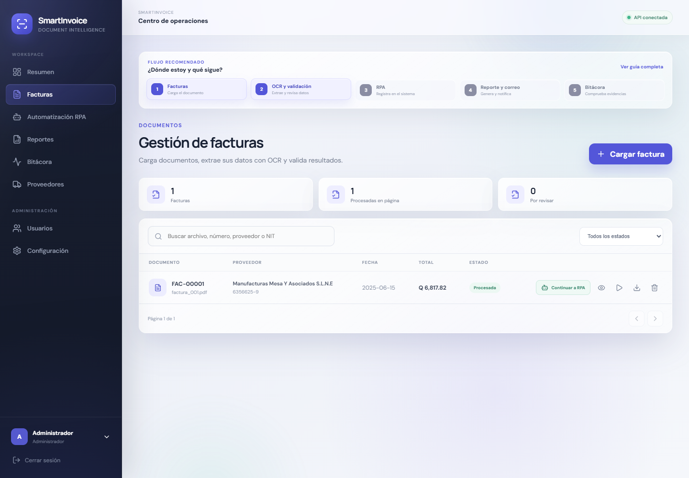

Los estados principales son:

- **Pendiente:** el archivo fue cargado, pero todavía no se ha procesado.
- **Procesada:** los datos fueron extraídos y validados.
- **Con observaciones:** la extracción necesita revisión.
- **Rechazada:** el documento no fue aprobado.

### 6.1 Cargar una factura

1. Seleccione **Cargar factura**.
2. Arrastre el documento al área indicada o haga clic para buscarlo.
3. Verifique que el archivo seleccionado sea el correcto.
4. Seleccione nuevamente **Cargar factura**.

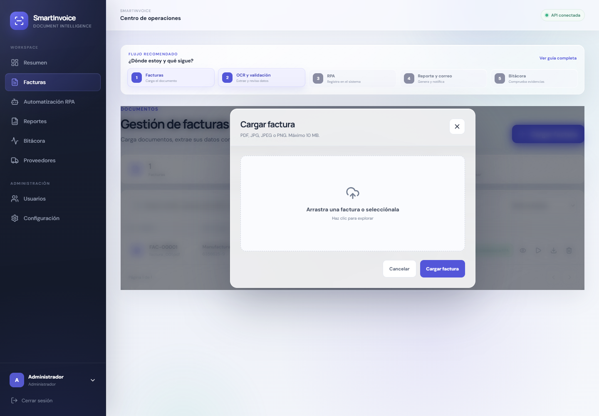

Después de la carga, la factura aparecerá en el listado. El sistema admite PDF, JPG, JPEG
y PNG.

### 6.2 Procesar el documento con OCR

En la fila de la factura, seleccione el botón **Procesar OCR**. SmartInvoice realiza las
siguientes acciones:

1. Convierte el PDF a imagen cuando es necesario.
2. Mejora la imagen mediante Computer Vision.
3. Reconoce el texto mediante Tesseract OCR.
4. Extrae número de factura, fecha, proveedor, NIT, subtotal, impuestos y total.
5. Ejecuta validaciones automáticas.
6. Guarda el resultado y registra la operación en la bitácora.

El procesamiento puede tardar algunos segundos según el tamaño y la calidad del
documento.

### 6.3 Consultar el detalle

Seleccione el botón **Ver detalle** de una factura para consultar la información extraída.

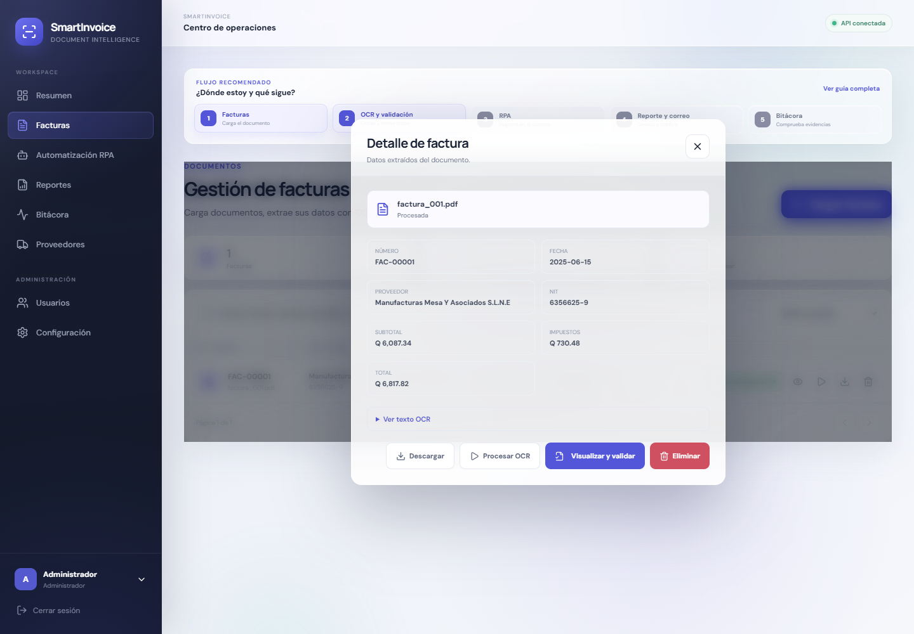

Desde esta ventana también se puede:

- Consultar el texto reconocido por OCR.
- Descargar el archivo original.
- Procesar nuevamente el OCR.
- Abrir la validación visual.
- Eliminar la factura, si el usuario posee permisos.

## 7. Visualización y validación

Desde el detalle de la factura, seleccione **Visualizar y validar**.

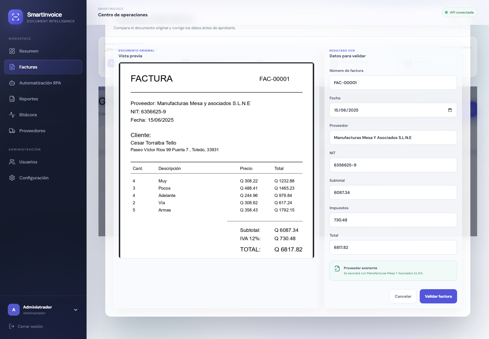

La ventana presenta:

- A la izquierda, una vista previa del documento original.
- A la derecha, los campos detectados por el OCR.

Revise cada valor contra el documento. Si encuentra un error, corrija el campo antes de
seleccionar **Validar factura**.

La validación comprueba, entre otros aspectos:

- Que los campos obligatorios tengan información.
- Que los montos sean numéricos y no sean negativos.
- Que el total sea coherente con el subtotal y los impuestos.
- Que la fecha tenga un formato válido.
- Que el proveedor pueda asociarse por su NIT.

### 7.1 Registro automático del proveedor

Durante la validación pueden presentarse dos casos:

- **Proveedor existente:** la factura se asocia con el proveedor que ya tiene el mismo NIT.
- **Proveedor nuevo:** SmartInvoice permite registrar los datos detectados en el directorio
  de proveedores.

Esto evita crear proveedores duplicados y permite consultar posteriormente todas las
facturas asociadas.

## 8. Proveedores

Seleccione **Proveedores** para consultar y administrar el directorio comercial.

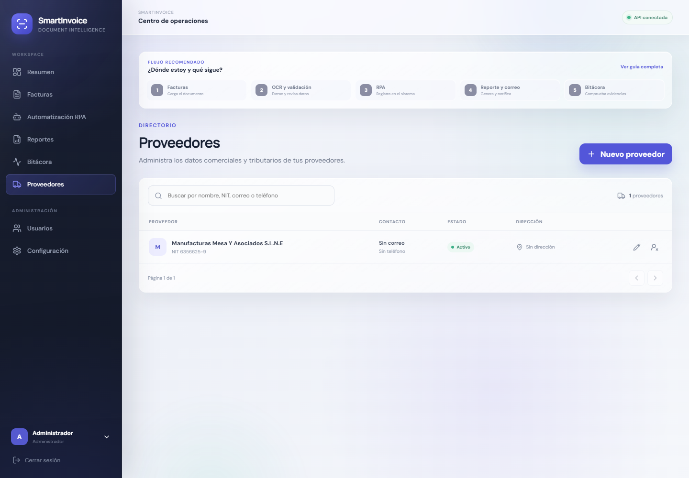

El módulo permite:

- Crear proveedores.
- Consultar nombre, NIT, contacto, dirección y estado.
- Editar la información.
- Activar o desactivar registros.
- Eliminar proveedores cuando las reglas del sistema lo permitan.

### 8.1 Crear un proveedor manualmente

1. Seleccione **Nuevo proveedor**.
2. Complete como mínimo el nombre y el NIT.
3. Agregue correo, teléfono y dirección cuando estén disponibles.
4. Guarde el registro.

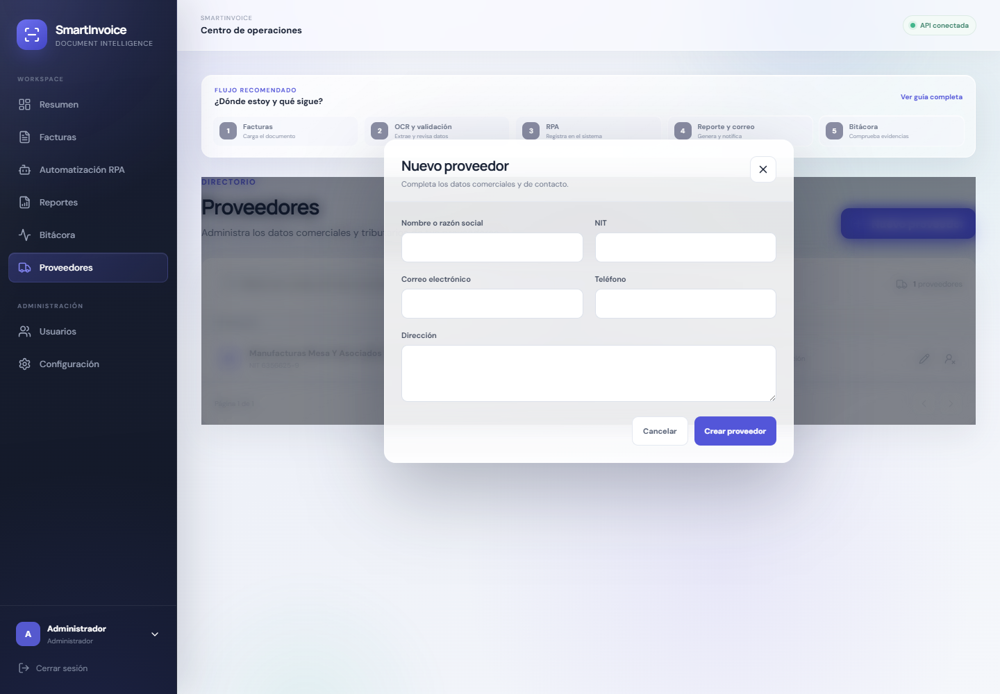

## 9. Automatización RPA

Después de validar una factura, seleccione **Automatización RPA**.

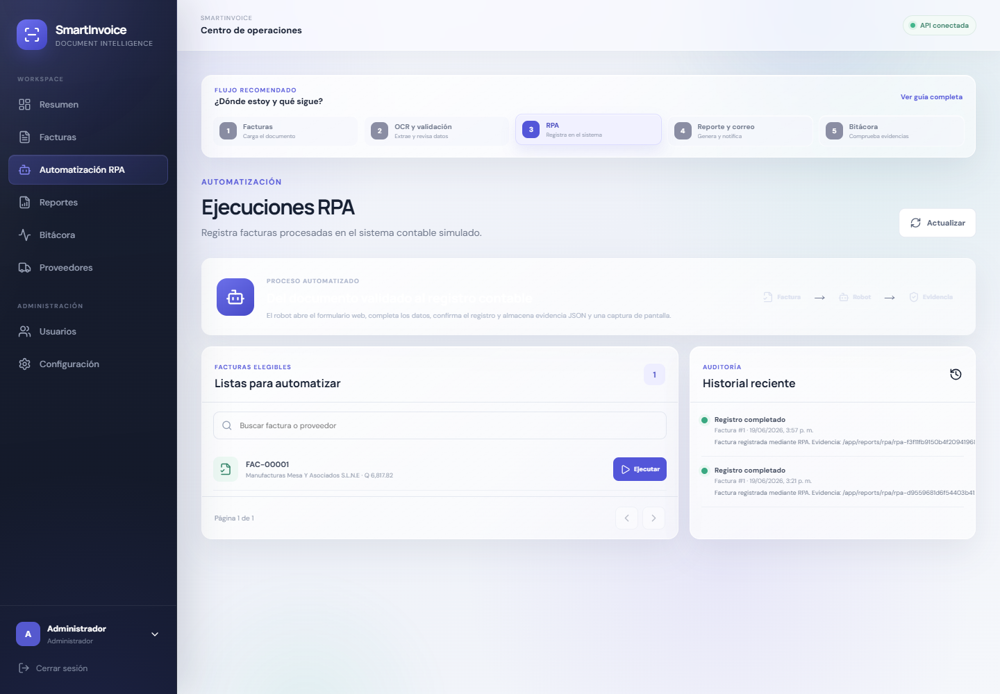

La sección **Facturas elegibles** muestra los documentos que ya pueden registrarse. Para
iniciar el proceso:

1. Localice la factura.
2. Seleccione **Ejecutar**.
3. Revise la confirmación.
4. Seleccione **Ejecutar RPA**.

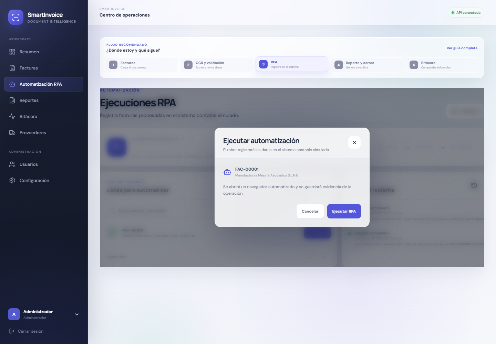

El robot abre el formulario contable simulado, completa automáticamente los datos,
presiona el botón de registro y guarda una evidencia JSON junto con una captura de
pantalla.

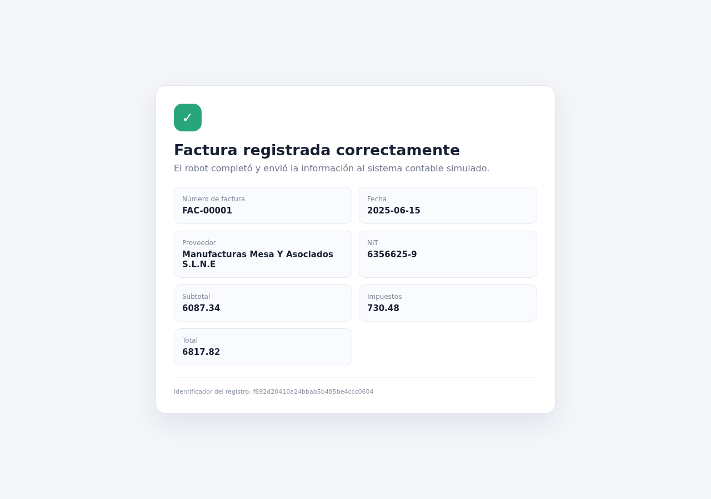

Al finalizar, el resultado se muestra en el historial reciente y también se registra en la
bitácora. La dirección interna `http://api:8000/...` es utilizada entre contenedores; para
abrir una ruta desde el navegador del equipo debe utilizarse `http://localhost:8000/...`.

## 10. Reportes administrativos y correo

Seleccione **Reportes** para consultar los archivos generados.

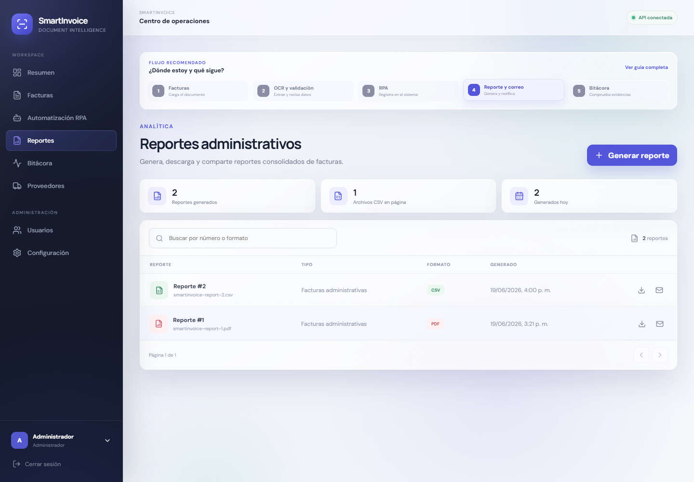

### 10.1 Generar un reporte

1. Seleccione **Generar reporte**.
2. Elija el formato:
   - **PDF:** documento visual listo para compartir.
   - **CSV:** datos compatibles con Excel y otras hojas de cálculo.
3. Utilice los filtros de fecha, proveedor o estado si son necesarios.
4. Seleccione **Generar reporte**.

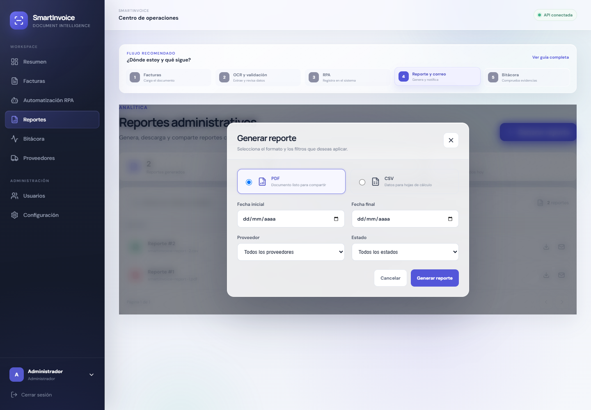

El archivo generado aparecerá en el listado y podrá descargarse.

### 10.2 Envío automático por correo

Cuando el correo SMTP se encuentra habilitado, SmartInvoice envía automáticamente el
reporte generado a la dirección configurada por el administrador.

El envío ocurre **después de generar correctamente el reporte**. Para comprobarlo:

1. Revise la bandeja de entrada y la carpeta de correo no deseado.
2. Consulte la bitácora.
3. Busque el evento **Reporte enviado**.

Si la generación funciona, pero el correo no se envía, el reporte seguirá disponible para
descarga y la bitácora mostrará la incidencia correspondiente.

## 11. Bitácora de procesamiento

Seleccione **Bitácora** para consultar las acciones realizadas por el sistema.

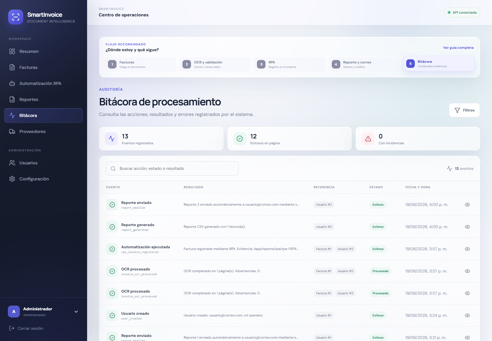

Cada evento incluye:

- Acción realizada.
- Resultado obtenido.
- Factura o usuario relacionado.
- Estado.
- Fecha y hora.
- Detalle adicional.

La bitácora permite demostrar la ejecución del OCR, la validación, la automatización RPA,
la generación de reportes y el envío de correos.

## 12. Administración de usuarios

Esta opción está disponible para usuarios administradores.

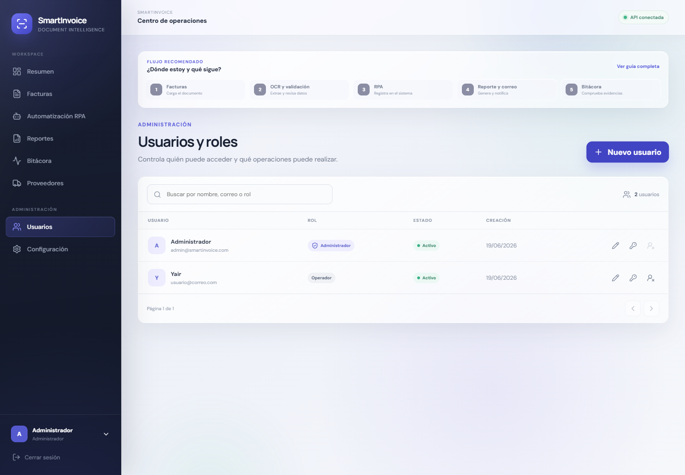

El administrador puede:

- Crear usuarios.
- Asignar el rol de administrador u operador.
- Activar o desactivar cuentas.
- Editar información.
- Eliminar usuarios cuando corresponda.

El operador utiliza las funciones del flujo de facturas, mientras que el administrador
también controla usuarios y configuración.

## 13. Cerrar sesión

Para salir del sistema:

1. Localice el perfil en la parte inferior del menú lateral.
2. Seleccione **Cerrar sesión**.
3. Verifique que se muestre nuevamente la pantalla de acceso.

Se recomienda cerrar sesión al terminar, especialmente en equipos compartidos.

## 14. Solución de problemas frecuentes

### No puedo iniciar sesión

- Verifique el correo y la contraseña.
- Compruebe que la cuenta esté activa.
- Solicite al administrador revisar el usuario.

### El documento no se carga

- Confirme que sea PDF, JPG, JPEG o PNG.
- Compruebe que no supere 10 MB.
- Evite nombres excesivamente largos o archivos dañados.

### El OCR extrajo datos incorrectos

- Utilice **Visualizar y validar**.
- Corrija los campos manualmente.
- Procese nuevamente el documento si la imagen fue reemplazada por una versión más clara.

### La factura no aparece en RPA

- Confirme que el OCR haya finalizado.
- Valide la factura.
- Revise que no tenga estado rechazado.

### El RPA no abre la dirección `api`

La palabra `api` es el nombre interno del contenedor Docker y no es una dirección pública.
Desde el navegador del equipo use `localhost:8000`.

### No llegó el correo

- Revise la carpeta de correo no deseado.
- Confirme que el reporte sí fue generado.
- Consulte el evento correspondiente en la bitácora.
- Solicite al administrador verificar la configuración SMTP.

## 15. Resumen de comprobación

Una factura completó correctamente todo el flujo cuando:

- Aparece como procesada en **Facturas**.
- Sus datos fueron revisados y validados.
- El proveedor quedó asociado o registrado.
- Existe una ejecución exitosa en **Automatización RPA**.
- Se generó un archivo en **Reportes**.
- La bitácora contiene la generación y, cuando SMTP está habilitado, el envío del correo.

