# Manual de Usuario

# Doctor Byte

## 1. Descripcion general

Doctor Byte es un sistema experto para diagnosticar fallas comunes en computadoras. El usuario selecciona sintomas desde una interfaz web y el sistema consulta reglas en Prolog para devolver una falla probable y una recomendacion.

El sistema tambien incluye una vista de administrador para gestionar la base de conocimiento sin editar manualmente los archivos `.pl`.

---

## 2. Requisitos

Para ejecutar con Docker:

- Docker Desktop instalado.
- Docker Compose disponible.
- Puerto `5173` libre para el frontend.
- Puerto `8000` libre para el backend.

---

## 3. Ejecucion del sistema

Desde la carpeta raiz del proyecto:

```bash
docker compose up --build
```

Abrir en el navegador:

```txt
http://localhost:5173
```

Backend:

```txt
http://localhost:8000
```

Documentacion de la API:

```txt
http://localhost:8000/docs
```

Para detener el sistema:

```bash
docker compose down
```

---

## 4. Vista de diagnostico

La vista principal permite seleccionar sintomas y generar un diagnostico.

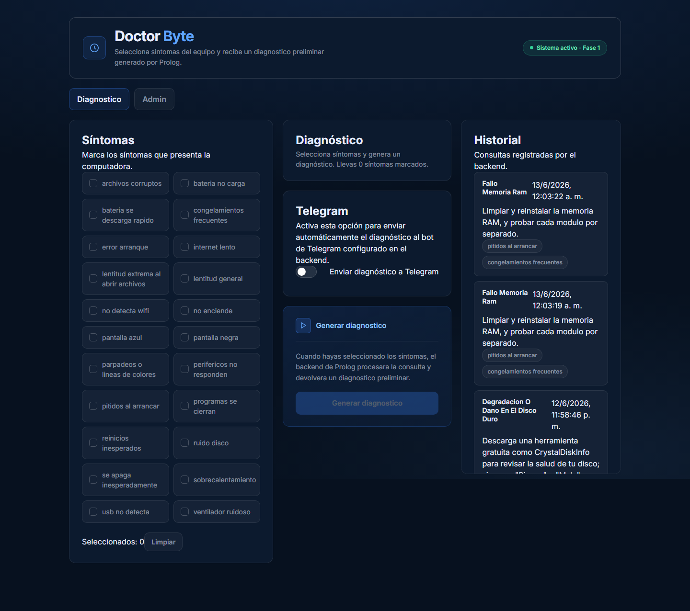

Uso basico:

1. Entrar a `http://localhost:5173`.
2. Abrir la pestana `Diagnostico`.
3. Seleccionar los sintomas que presenta el equipo.
4. Revisar sintomas sugeridos con la etiqueta `match`.
5. Presionar `Generar diagnostico`.
6. Leer la falla detectada y la recomendacion.

---

## 5. Seleccionar sintomas y generar diagnostico

Para generar un diagnostico se deben seleccionar sintomas relacionados con el problema del equipo.

### Paso 1: seleccionar un sintoma

Al seleccionar un sintoma, el sistema puede resaltar otros sintomas relacionados con la etiqueta `match`.

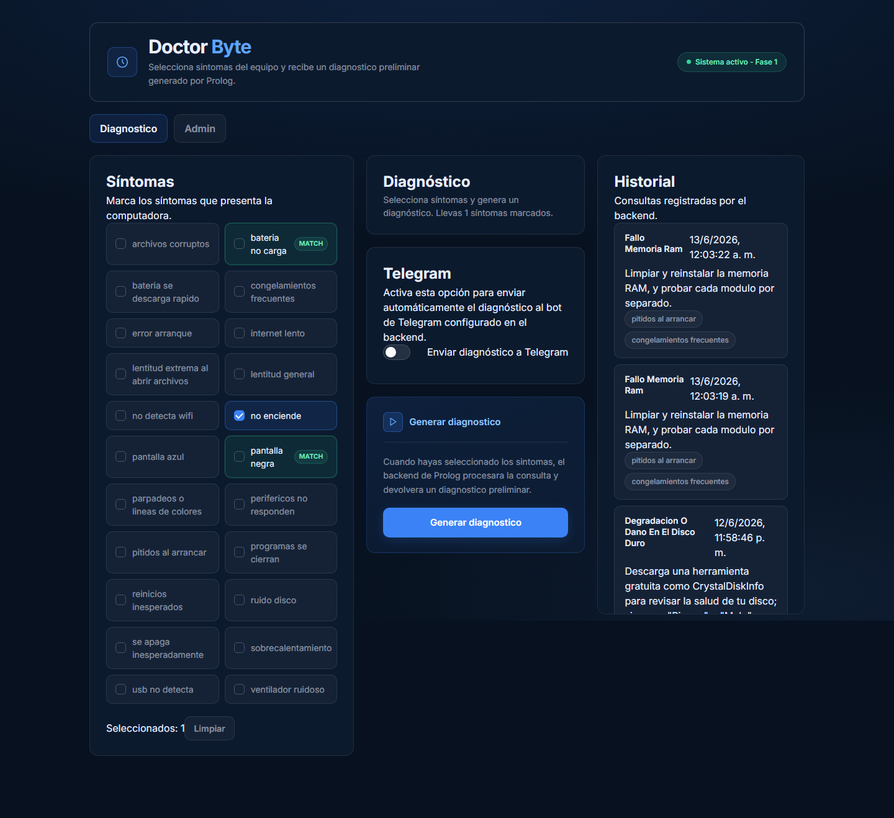

Esto ayuda al usuario a identificar sintomas que completan una regla de diagnostico.

### Paso 2: seleccionar sintomas relacionados

Cuando se seleccionan sintomas que coinciden con una regla, el boton `Generar diagnostico` queda disponible.

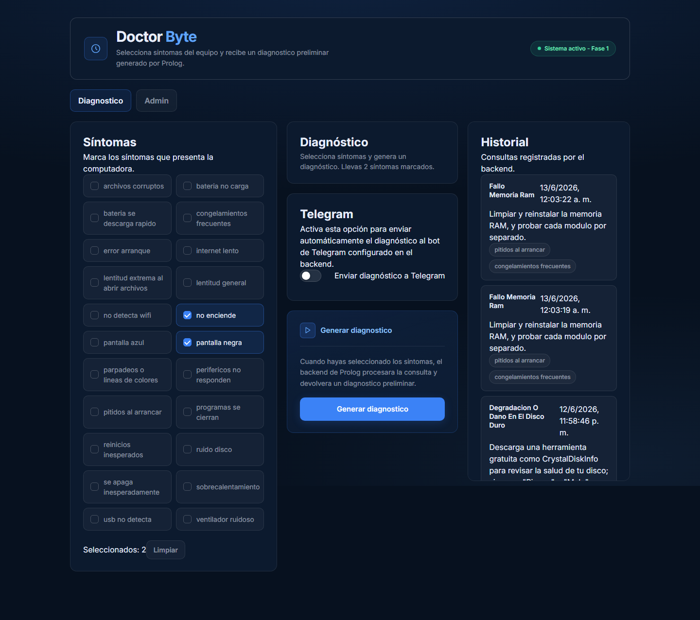

### Paso 3: generar diagnostico

Presionar el boton:

```txt
Generar diagnostico
```

El sistema consulta Prolog y muestra:

- Falla detectada.
- Recomendacion.
- Sintomas utilizados.

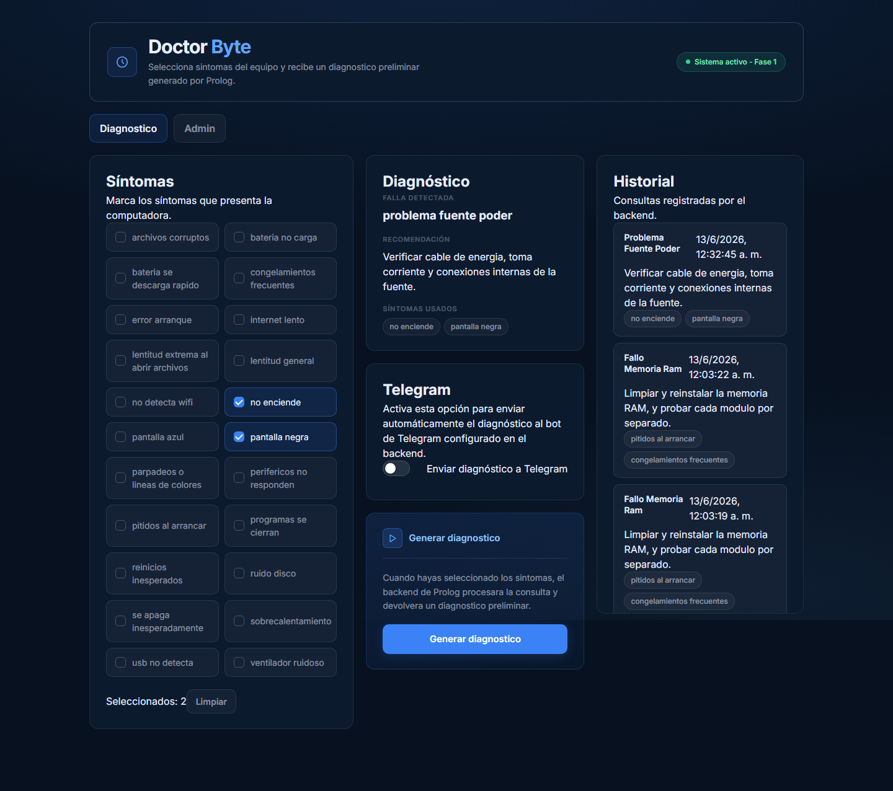

El diagnostico tambien se guarda en el historial.

---

## 6. Telegram

El sistema permite enviar el diagnostico generado a Telegram.

Desde `Admin > Telegram` se puede configurar el comportamiento del bot.

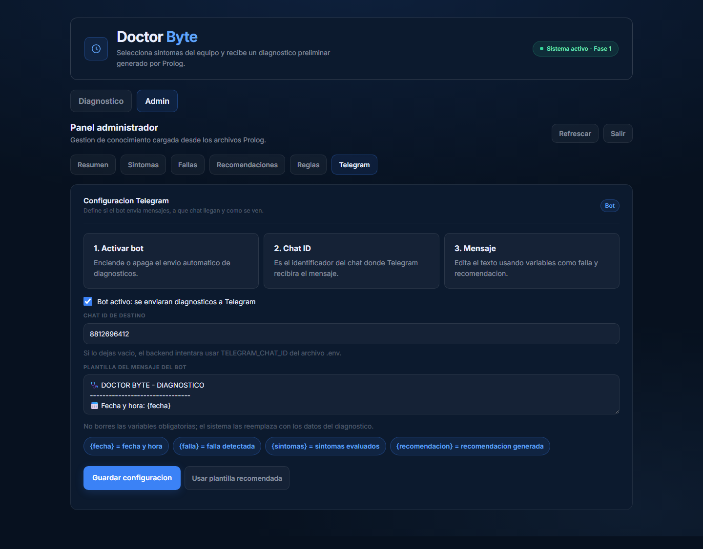

Opciones disponibles:

- Activar o desactivar el envio de mensajes.
- Modificar el Chat ID de destino.
- Editar la plantilla del mensaje.
- Restaurar una plantilla recomendada.

Variables disponibles para la plantilla:

```txt
{fecha}
{falla}
{sintomas}
{recomendacion}
```

Para usarlo:

1. Configurar `TELEGRAM_BOT_TOKEN`.
2. Configurar `TELEGRAM_CHAT_ID`.
3. Activar la opcion de Telegram en la vista de diagnostico.
4. Generar el diagnostico.

El mensaje incluye:

- Fecha y hora.
- Falla detectada.
- Sintomas evaluados.
- Recomendacion.

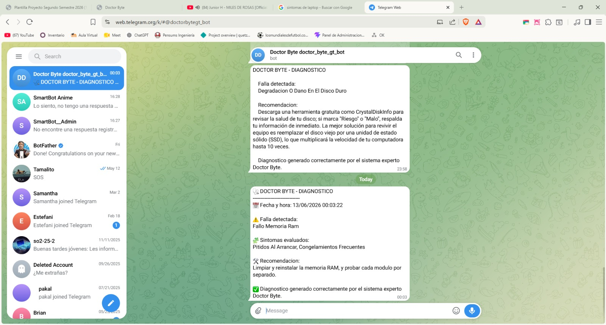

---

## 7. Acceso al administrador

Para administrar la base de conocimiento:

1. Abrir la pestana `Admin`.
2. Escribir la contrasena.
3. Presionar `Entrar al admin`.

Contrasena por defecto:

```txt
admin123
```

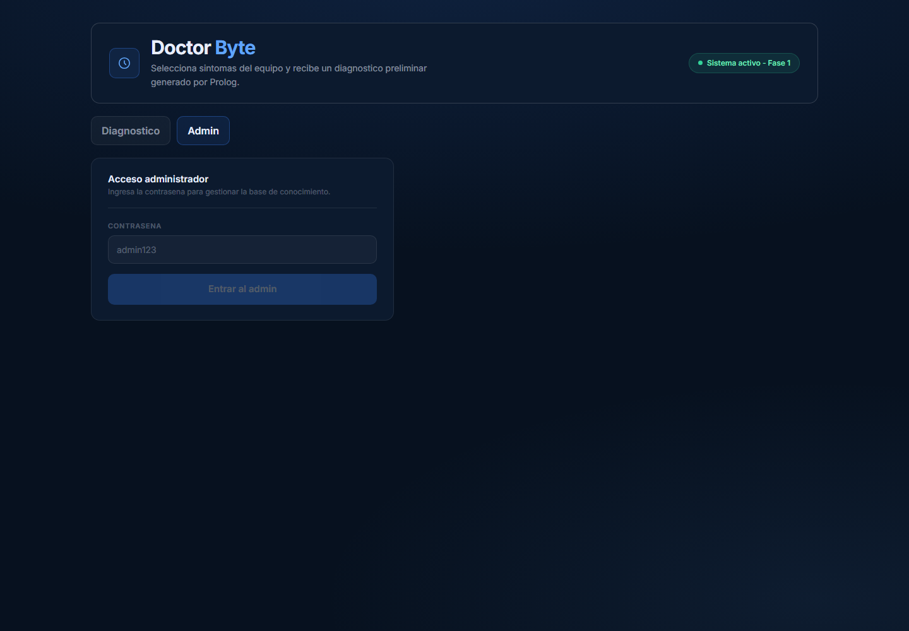

---

## 8. Panel de administrador

Despues de iniciar sesion se muestra el resumen general.

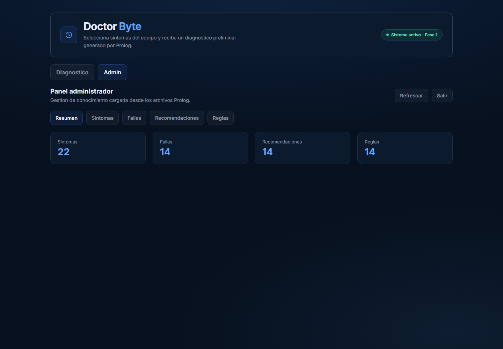

El menu del administrador contiene:

```txt
Resumen | Sintomas | Fallas | Recomendaciones | Reglas
```

Desde este menu se puede gestionar cada parte de la base de conocimiento.

---

## 9. CRUD de sintomas

La seccion `Sintomas` permite administrar los sintomas disponibles para diagnostico.

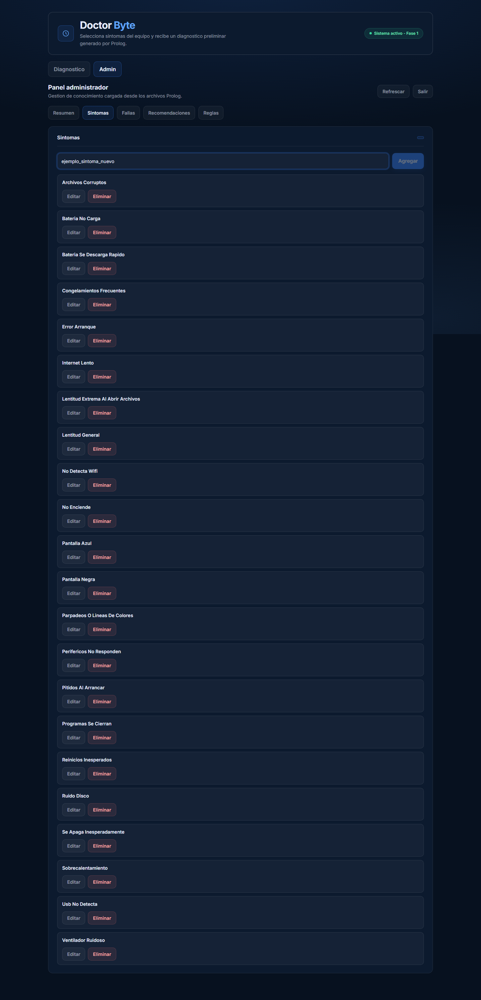

Acciones disponibles:

- Ver sintomas existentes.
- Agregar un nuevo sintoma.
- Editar un sintoma.
- Eliminar un sintoma.

Para agregar:

1. Entrar a `Admin`.
2. Abrir `Sintomas`.
3. Escribir el nombre del sintoma.
4. Presionar `Agregar`.

El sistema normaliza el nombre para que sea compatible con Prolog. Por ejemplo:

```txt
Pantalla con lineas
```

se convierte en:

```txt
pantalla_con_lineas
```

### Editar sintomas

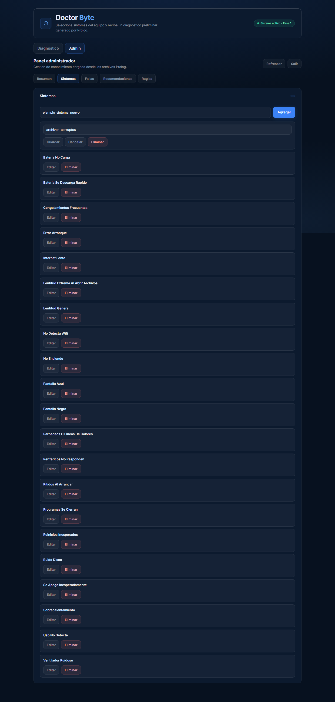

Para editar:

1. Presionar `Editar`.
2. Modificar el nombre.
3. Presionar `Guardar`.

Tambien se puede presionar `Cancelar` para salir del modo edicion.

Nota: si el sintoma esta asociado a una regla, el sistema puede bloquear la eliminacion para evitar romper diagnosticos.

---

## 10. CRUD de fallas

La seccion `Fallas` permite administrar las fallas diagnosticables.

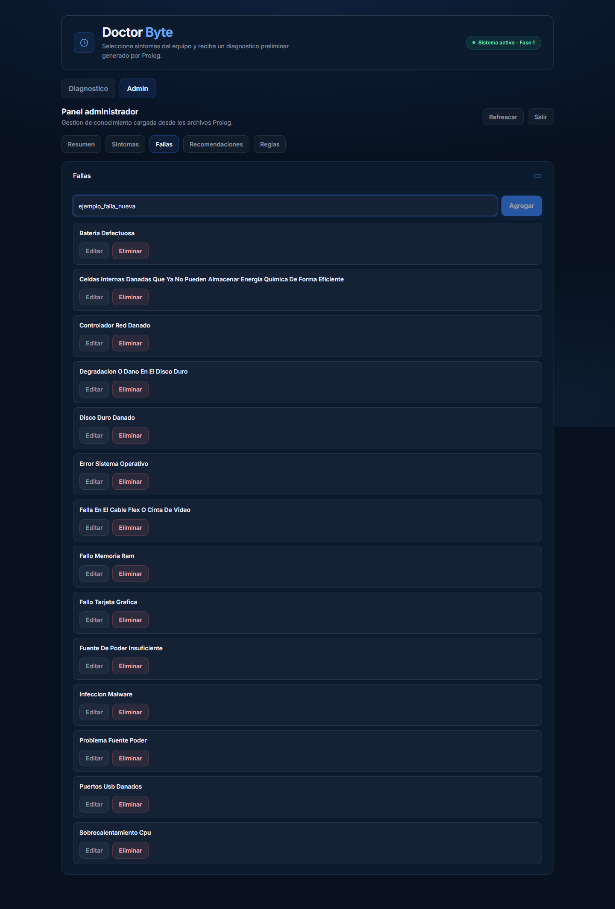

Acciones disponibles:

- Ver fallas existentes.
- Agregar una nueva falla.
- Editar una falla.
- Eliminar una falla.

Para agregar una falla:

1. Abrir `Admin`.
2. Entrar a `Fallas`.
3. Escribir el nombre de la falla.
4. Presionar `Agregar`.

Si la falla esta asociada a una recomendacion o regla, el sistema puede bloquear su eliminacion.

---

## 11. CRUD de recomendaciones

La seccion `Recomendaciones` permite administrar el texto de solucion asociado a cada falla.

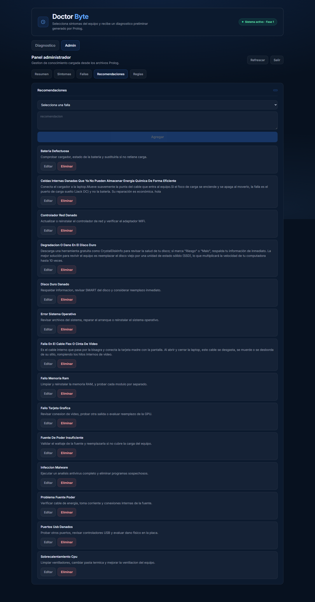

Acciones disponibles:

- Seleccionar una falla existente.
- Agregar recomendacion.
- Actualizar recomendacion.
- Eliminar recomendacion.

Para agregar o actualizar:

1. Entrar a `Recomendaciones`.
2. Seleccionar una falla del listado.
3. Escribir o modificar la recomendacion.
4. Presionar `Agregar` o `Actualizar`.

Si la falla ya tiene recomendacion, el sistema carga el texto existente para poder modificarlo.

---

## 12. CRUD de reglas

La seccion `Reglas` permite asociar fallas con sintomas.

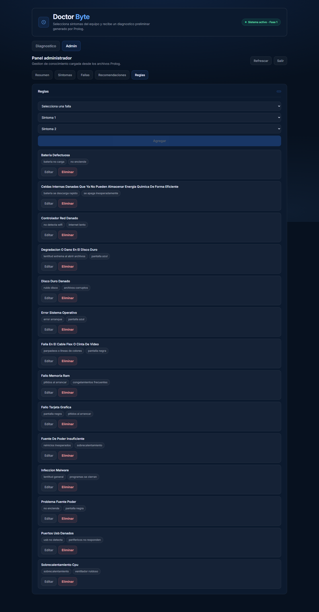

Acciones disponibles:

- Ver reglas existentes.
- Crear regla.
- Editar regla.
- Eliminar regla.

Para crear una regla:

1. Entrar a `Reglas`.
2. Seleccionar una falla.
3. Seleccionar `Sintoma 1`.
4. Seleccionar `Sintoma 2`, si aplica.
5. Presionar `Agregar`.

Las fallas y sintomas se seleccionan desde listados existentes, por lo que no es necesario escribirlos manualmente.

Esto evita errores como:

- Sintomas mal escritos.
- Fallas inexistentes.
- Reglas incompletas.

---

## 13. Confirmacion de eliminacion

Antes de eliminar sintomas, fallas, recomendaciones o reglas, el sistema muestra una confirmacion.

Si se confirma, el registro se elimina.

Si se cancela, no se realiza ningun cambio.

---

## 14. Cerrar sesion del administrador

Para salir del panel:

1. Presionar `Salir`.
2. El sistema elimina el token local.
3. Para volver a entrar se debe escribir nuevamente la contrasena.

---

## 15. Problemas comunes

### No aparece un sintoma en diagnostico

Verificar que se haya agregado en la seccion `Sintomas`, no en `Fallas`.

### No se puede eliminar un sintoma

Puede estar asociado a una regla. Primero se debe editar o eliminar la regla correspondiente.

### No se puede eliminar una falla

Puede estar asociada a una recomendacion o regla.

### No se puede crear una regla

Verificar que:

- La falla exista.
- La falla tenga recomendacion.
- Los sintomas existan.
- La falla no tenga ya una regla registrada.

---

## 16. Cierre

Doctor Byte permite diagnosticar fallas mediante Prolog y administrar la base de conocimiento desde una interfaz web. El panel Admin facilita el mantenimiento de sintomas, fallas, recomendaciones y reglas sin editar directamente los archivos Prolog.
